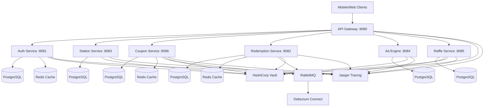

# Design Document

## Overview

The Gasolinera JSM Digital Coupon Platform is designed as a cloud-native microservices architecture built with Spring Boot and Kotlin. The system leverages containerization with Docker and orchestration with Docker Compose to provide a scalable, maintainable, and resilient platform for gamified coupon management and raffle systems.

The architecture follows Domain-Driven Design (DDD) principles with clear service boundaries, implements hexagonal architecture patterns for core services, and uses event-driven communication for loose coupling between services.

## Architecture

### System Architecture Diagram



### Service Communication Patterns

1. **Synchronous Communication**: REST APIs through the API Gateway for client-facing operations
2. **Asynchronous Communication**: Event-driven messaging via RabbitMQ for inter-service communication
3. **Data Consistency**: Event sourcing with Debezium for change data capture and eventual consistency
4. **Caching Strategy**: Redis for session management, frequently accessed data, and rate limiting

## Components and Interfaces

### 1. API Gateway Service

**Responsibilities:**
- Route requests to appropriate microservices
- JWT token validation and authentication
- Rate limiting and request throttling
- Circuit breaker implementation
- Request/response logging and monitoring

**Key Interfaces:**
```kotlin
// Gateway Configuration
@Configuration
class GatewayConfig {
    @Bean
    fun routeLocator(): RouteLocator

    @Bean
    fun jwtAuthenticationFilter(): JwtAuthenticationFilter

    @Bean
    fun circuitBreakerConfig(): CircuitBreakerConfig
}
```

**Routing Rules:**
- `/api/auth/**` → Auth Service
- `/api/stations/**` → Station Service
- `/api/coupons/**` → Coupon Service
- `/api/redemptions/**` → Redemption Service
- `/api/ads/**` → Ad Engine
- `/api/raffles/**` → Raffle Service

### 2. Auth Service

**Responsibilities:**
- User registration and authentication
- JWT token generation and validation
- Role-based access control (RBAC)
- OTP-based phone verification
- Session management with Redis

**Core Entities:**
```kotlin
@Entity
data class User(
    @Id @GeneratedValue
    val id: Long = 0,

    @Column(unique = true)
    val phoneNumber: String,

    val firstName: String,
    val lastName: String,

    @Enumerated(EnumType.STRING)
    val role: UserRole,

    val isActive: Boolean = true,
    val isPhoneVerified: Boolean = false,

    @CreationTimestamp
    val createdAt: LocalDateTime = LocalDateTime.now(),

    @UpdateTimestamp
    val updatedAt: LocalDateTime = LocalDateTime.now()
)

enum class UserRole {
    CUSTOMER, EMPLOYEE, STATION_ADMIN, SYSTEM_ADMIN
}
```

**API Endpoints:**
- `POST /api/auth/register` - User registration
- `POST /api/auth/login/otp` - Request OTP for login
- `POST /api/auth/login/verify` - Verify OTP and get tokens
- `POST /api/auth/refresh` - Refresh JWT token
- `GET /api/auth/profile` - Get user profile
- `POST /api/auth/logout` - Logout and invalidate tokens

### 3. Station Service

**Responsibilities:**
- Gas station management
- Employee assignment and management
- Station operational status tracking
- Location-based station queries

**Core Entities:**
```kotlin
@Entity
data class Station(
    @Id @GeneratedValue
    val id: Long = 0,

    val name: String,
    val address: String,
    val latitude: Double,
    val longitude: Double,
    val phoneNumber: String,

    @Enumerated(EnumType.STRING)
    val status: StationStatus = StationStatus.ACTIVE,

    @OneToMany(mappedBy = "station")
    val employees: List<Employee> = emptyList(),

    @CreationTimestamp
    val createdAt: LocalDateTime = LocalDateTime.now()
)

@Entity
data class Employee(
    @Id @GeneratedValue
    val id: Long = 0,

    val userId: Long, // Reference to User in Auth Service

    @ManyToOne
    @JoinColumn(name = "station_id")
    val station: Station,

    @Enumerated(EnumType.STRING)
    val role: EmployeeRole,

    val isActive: Boolean = true
)

enum class StationStatus { ACTIVE, INACTIVE, MAINTENANCE }
enum class EmployeeRole { CASHIER, SUPERVISOR, MANAGER }
```

**API Endpoints:**
- `GET /api/stations` - List all active stations
- `GET /api/stations/{id}` - Get station details
- `POST /api/stations` - Create new station (admin only)
- `PUT /api/stations/{id}` - Update station details
- `GET /api/stations/{id}/employees` - List station employees
- `POST /api/stations/{id}/employees` - Assign employee to station

### 4. Coupon Service

**Responsibilities:**
- Coupon generation and management
- QR code generation with digital signatures
- Coupon validation and status tracking
- Campaign management for different coupon types

**Core Entities:**
```kotlin
@Entity
data class Coupon(
    @Id
    val id: String = UUID.randomUUID().toString(),

    val campaignId: Long,
    val qrCode: String, // Signed QR code data
    val qrSignature: String, // Digital signature for validation

    @Enumerated(EnumType.STRING)
    val status: CouponStatus = CouponStatus.ACTIVE,

    val discountAmount: BigDecimal,
    val raffleTickets: Int,

    val validFrom: LocalDateTime,
    val validUntil: LocalDateTime,

    @CreationTimestamp
    val createdAt: LocalDateTime = LocalDateTime.now()
)

@Entity
data class Campaign(
    @Id @GeneratedValue
    val id: Long = 0,

    val name: String,
    val description: String,
    val discountAmount: BigDecimal,
    val raffleTicketsPerCoupon: Int,

    val startDate: LocalDateTime,
    val endDate: LocalDateTime,

    val isActive: Boolean = true
)

enum class CouponStatus { ACTIVE, USED, EXPIRED, CANCELLED }
```

**API Endpoints:**
- `POST /api/coupons/generate` - Generate new coupons for campaign
- `GET /api/coupons/{id}` - Get coupon details
- `POST /api/coupons/{id}/validate` - Validate coupon QR code
- `GET /api/campaigns` - List active campaigns
- `POST /api/campaigns` - Create new campaign (admin only)

### 5. Redemption Service

**Responsibilities:**
- Process coupon redemptions at gas stations
- Generate raffle tickets upon successful redemption
- Track redemption history and analytics
- Handle redemption events and notifications

**Core Entities:**
```kotlin
@Entity
data class Redemption(
    @Id @GeneratedValue
    val id: Long = 0,

    val couponId: String,
    val userId: Long,
    val stationId: Long,
    val employeeId: Long,

    val discountAmount: BigDecimal,
    val raffleTicketsGenerated: Int,

    @CreationTimestamp
    val redeemedAt: LocalDateTime = LocalDateTime.now(),

    @Enumerated(EnumType.STRING)
    val status: RedemptionStatus = RedemptionStatus.COMPLETED
)

@Entity
data class RaffleTicket(
    @Id @GeneratedValue
    val id: Long = 0,

    val userId: Long,
    val redemptionId: Long,
    val ticketNumber: String,

    @Enumerated(EnumType.STRING)
    val status: TicketStatus = TicketStatus.ACTIVE,

    @CreationTimestamp
    val createdAt: LocalDateTime = LocalDateTime.now()
)

enum class RedemptionStatus { COMPLETED, FAILED, CANCELLED }
enum class TicketStatus { ACTIVE, USED_IN_RAFFLE, EXPIRED }
```

**API Endpoints:**
- `POST /api/redemptions` - Process coupon redemption
- `GET /api/redemptions/user/{userId}` - Get user redemption history
- `GET /api/redemptions/station/{stationId}` - Get station redemption history
- `GET /api/tickets/user/{userId}` - Get user's raffle tickets

### 6. Ad Engine Service

**Responsibilities:**
- Serve targeted advertisements to users
- Track ad engagement and completion
- Multiply raffle tickets based on ad interaction
- Manage advertiser campaigns and budgets

**Core Entities:**
```kotlin
@Entity
data class Advertisement(
    @Id @GeneratedValue
    val id: Long = 0,

    val title: String,
    val description: String,
    val videoUrl: String,
    val thumbnailUrl: String,

    val advertiserId: Long,
    val ticketMultiplier: Int, // How many tickets to multiply

    val startDate: LocalDateTime,
    val endDate: LocalDateTime,

    val isActive: Boolean = true
)

@Entity
data class AdEngagement(
    @Id @GeneratedValue
    val id: Long = 0,

    val userId: Long,
    val advertisementId: Long,

    val startedAt: LocalDateTime,
    val completedAt: LocalDateTime?,

    @Enumerated(EnumType.STRING)
    val status: EngagementStatus,

    val ticketsAwarded: Int = 0
)

enum class EngagementStatus { STARTED, COMPLETED, ABANDONED }
```

**API Endpoints:**
- `GET /api/ads/available` - Get available ads for user
- `POST /api/ads/{id}/start` - Start watching advertisement
- `POST /api/ads/{id}/complete` - Mark advertisement as completed
- `GET /api/ads/history/{userId}` - Get user's ad engagement history

### 7. Raffle Service

**Responsibilities:**
- Manage raffle draws and prize distribution
- Calculate winning probabilities based on ticket counts
- Handle prize fulfillment and winner notifications
- Generate raffle analytics and reports

**Core Entities:**
```kotlin
@Entity
data class Raffle(
    @Id @GeneratedValue
    val id: Long = 0,

    val name: String,
    val description: String,

    val drawDate: LocalDateTime,
    val registrationDeadline: LocalDateTime,

    @Enumerated(EnumType.STRING)
    val status: RaffleStatus = RaffleStatus.OPEN,

    @OneToMany(mappedBy = "raffle")
    val prizes: List<Prize> = emptyList()
)

@Entity
data class Prize(
    @Id @GratedValue
    val id: Long = 0,

    @ManyToOne
    @JoinColumn(name = "raffle_id")
    val raffle: Raffle,

    val name: String,
    val description: String,
    val value: BigDecimal,
    val quantity: Int,

    val winnerId: Long? = null,
    val wonAt: LocalDateTime? = null
)

enum class RaffleStatus { OPEN, CLOSED, DRAWN, COMPLETED }
```

**API Endpoints:**
- `GET /api/raffles/active` - Get active raffles
- `GET /api/raffles/{id}` - Get raffle details
- `POST /api/raffles/{id}/enter` - Enter raffle with tickets
- `POST /api/raffles/{id}/draw` - Execute raffle draw (admin only)
- `GET /api/raffles/{id}/winners` - Get raffle winners

## Data Models

### Database Schema Design

The system uses PostgreSQL as the primary database with separate schemas for each service to maintain data isolation:

- `auth_schema`: User management and authentication data
- `station_schema`: Station and employee information
- `coupon_schema`: Coupon campaigns and generation data
- `redemption_schema`: Redemption transactions and raffle tickets
- `ad_schema`: Advertisement campaigns and engagement tracking
- `raffle_schema`: Raffle management and prize distribution

### Event Schema for Inter-Service Communication

```kotlin
// Base Event Structure
abstract class DomainEvent(
    val eventId: String = UUID.randomUUID().toString(),
    val eventType: String,
    val aggregateId: String,
    val aggregateType: String,
    val eventVersion: Int = 1,
    val occurredAt: LocalDateTime = LocalDateTime.now()
)

// Specific Events
data class CouponRedeemedEvent(
    val couponId: String,
    val userId: Long,
    val stationId: Long,
    val discountAmount: BigDecimal,
    val raffleTicketsGenerated: Int
) : DomainEvent(
    eventType = "CouponRedeemed",
    aggregateId = couponId,
    aggregateType = "Coupon"
)

data class AdCompletedEvent(
    val userId: Long,
    val advertisementId: Long,
    val ticketMultiplier: Int
) : DomainEvent(
    eventType = "AdCompleted",
    aggregateId = advertisementId.toString(),
    aggregateType = "Advertisement"
)
```

## Error Handling

### Global Exception Handling Strategy

Each service implements a consistent error handling approach:

```kotlin
@RestControllerAdvice
class GlobalExceptionHandler {

    @ExceptionHandler(ValidationException::class)
    fun handleValidation(ex: ValidationException): ResponseEntity<ErrorResponse> {
        return ResponseEntity.badRequest().body(
            ErrorResponse(
                code = "VALIDATION_ERROR",
                message = ex.message,
                timestamp = LocalDateTime.now()
            )
        )
    }

    @ExceptionHandler(ResourceNotFoundException::class)
    fun handleNotFound(ex: ResourceNotFoundException): ResponseEntity<ErrorResponse> {
        return ResponseEntity.notFound().build()
    }

    @ExceptionHandler(BusinessLogicException::class)
    fun handleBusinessLogic(ex: BusinessLogicException): ResponseEntity<ErrorResponse> {
        return ResponseEntity.unprocessableEntity().body(
            ErrorResponse(
                code = ex.errorCode,
                message = ex.message,
                timestamp = LocalDateTime.now()
            )
        )
    }
}
```

### Circuit Breaker Configuration

```kotlin
@Configuration
class ResilienceConfig {

    @Bean
    fun circuitBreakerConfig(): CircuitBreakerConfig {
        return CircuitBreakerConfig.custom()
            .failureRateThreshold(50.0f)
            .waitDurationInOpenState(Duration.ofSeconds(30))
            .slidingWindowSize(10)
            .minimumNumberOfCalls(5)
            .build()
    }
}
```

## Testing Strategy

### Testing Pyramid Implementation

1. **Unit Tests (70%)**
   - Service layer business logic testing
   - Repository layer data access testing
   - Utility and helper function testing
   - Mock external dependencies

2. **Integration Tests (20%)**
   - Database integration testing with Testcontainers
   - Message queue integration testing
   - Inter-service communication testing
   - API endpoint testing with MockMvc

3. **End-to-End Tests (10%)**
   - Complete user journey testing
   - Cross-service workflow validation
   - Performance and load testing
   - Security penetration testing

### Test Configuration

```kotlin
@TestConfiguration
class TestConfig {

    @Bean
    @Primary
    fun testPostgreSQLContainer(): PostgreSQLContainer<*> {
        return PostgreSQLContainer("postgres:15")
            .withDatabaseName("test_db")
            .withUsername("test")
            .withPassword("test")
    }

    @Bean
    @Primary
    fun testRedisContainer(): GenericContainer<*> {
        return GenericContainer("redis:7")
            .withExposedPorts(6379)
    }
}
```

### Security Testing

- JWT token validation testing
- Role-based access control verification
- Input validation and sanitization testing
- SQL injection prevention testing
- XSS and CSRF protection validation

## Deployment and Infrastructure

### Container Configuration

Each service includes optimized Dockerfile:

```dockerfile
FROM openjdk:17-jre-slim

WORKDIR /app

COPY build/libs/*.jar app.jar

EXPOSE 8080

HEALTHCHECK --interval=30s --timeout=10s --start-period=40s --retries=3 \
  CMD curl -f http://localhost:8080/actuator/health || exit 1

ENTRYPOINT ["java", "-Xmx512m", "-Xms256m", "-jar", "app.jar"]
```

### Monitoring and Observability

- **Distributed Tracing**: OpenTelemetry with Jaeger
- **Metrics Collection**: Micrometer with Prometheus
- **Centralized Logging**: Structured JSON logging with Logback
- **Health Checks**: Spring Boot Actuator endpoints
- **Service Discovery**: Docker Compose service networking

### Security Configuration

- **Secret Management**: HashiCorp Vault integration
- **Database Security**: Connection encryption and credential rotation
- **API Security**: JWT-based authentication with RS256 signing
- **Network Security**: Service-to-service communication over internal Docker network