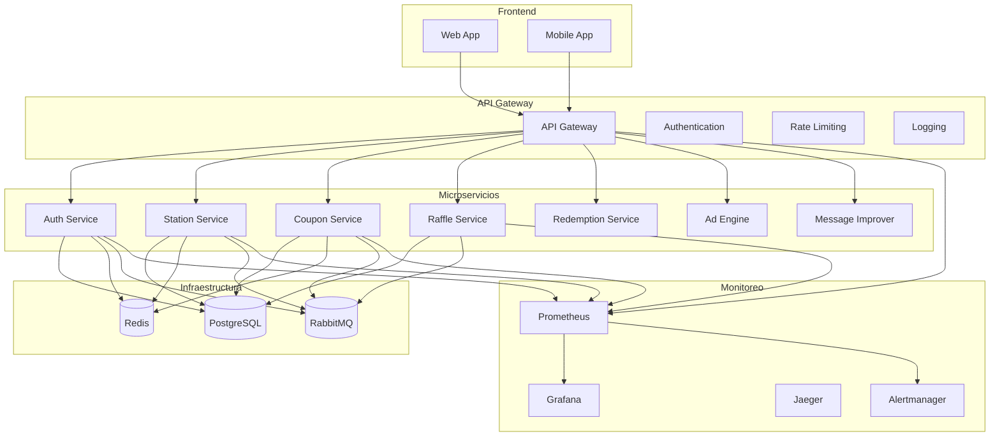

# 🏗️ Infraestructura Gasolinera JSM - Guía Completa

## 📋 Resumen Ejecutivo

La infraestructura de **Gasolinera JSM** ha sido completamente implementada siguiendo las mejores prácticas de DevOps, microservicios y observabilidad. Este documento proporciona una guía completa para operar, mantener y escalar el sistema.

## 🎯 Arquitectura General



## 🚀 Inicio Rápido

### 1. Setup Inicial Completo

```bash
# Clonar repositorio
git clone <repository-url>
cd gasolinera-jsm-ultimate

# Setup automático de infraestructura
./scripts/setup-infrastructure.sh development

# Validar configuración
./scripts/validate-infrastructure.sh --detailed --fix-issues
```

### 2. Iniciar Servicios

```bash
# Iniciar infraestructura base
docker-compose -f docker-compose.simple.yml up -d

# Iniciar servicios de aplicación
./start-services.sh

# Verificar estado
curl http://localhost:8080/health
```

### 3. Acceder a Interfaces

- **API Gateway**: http://localhost:8080
- **Prometheus**: http://localhost:9090
- **Grafana**: http://localhost:3000 (admin/admin123)
- **RabbitMQ Management**: http://localhost:15672
- **Jaeger**: http://localhost:16686

## 🔧 Componentes de Infraestructura

### 1. Sistema de Migraciones de Base de Datos

#### Características

- ✅ **Flyway Integration** con soporte PostgreSQL y MySQL
- ✅ **Rollback automático** con validación de integridad
- ✅ **Scripts versionados** con validación de sintaxis
- ✅ **Compatibilidad multi-motor** de BD

#### Uso

```bash
# Ejecutar migraciones
./gradlew flywayMigrate

# Ver estado de migraciones
./gradlew flywayInfo

# Rollback (manual)
./gradlew flywayUndo
```

#### Estructura de Migraciones

```
database/
├── migrations/
│   ├── V1__Create_auth_schema.sql
│   ├── V2__Create_station_schema.sql
│   └── V3__Create_coupon_schema.sql
├── mysql/
│   └── V1__Create_auth_schema_mysql.sql
└── flyway.conf
```

### 2. Gestión de Variables de Entorno

#### Configuración por Ambiente

```bash
# Desarrollo
./scripts/setup-environment.sh development

# Staging
./scripts/setup-environment.sh staging

# Producción
./scripts/setup-environment.sh production
```

#### Variables Críticas

- `DB_HOST`, `DB_NAME`, `DB_USERNAME`, `DB_PASSWORD`
- `JWT_SECRET` (mínimo 32 caracteres)
- `REDIS_HOST`, `RABBITMQ_HOST`
- URLs de servicios

#### Encriptación de Secretos

```kotlin
// Uso del EncryptionService
val encryptedValue = encryptionService.encrypt("sensitive-data")
val decryptedValue = encryptionService.decrypt(encryptedValue)
```

### 3. Health Checks Comprehensivos

#### Endpoints Disponibles

```bash
# Health check básico
GET /health

# Health check detallado
GET /health/dependencies

# Métricas del servicio
GET /health/metrics

# Verificación profunda
GET /health/deep

# Estado de preparación
GET /health/readiness

# Estado de vida
GET /health/liveness
```

#### Verificación de Dependencias

- **Base de datos**: Conectividad y pool de conexiones
- **Redis**: Conectividad y operaciones básicas
- **RabbitMQ**: Estado del broker y colas
- **Servicios externos**: APIs y endpoints críticos

### 4. API Gateway Completo

#### Características Principales

- ✅ **Enrutamiento dinámico** con balanceeo de carga
- ✅ **Autenticación centralizada** (JWT/OAuth/Basic)
- ✅ **Rate limiting distribuido** con Redis
- ✅ **Logging centralizado** con correlation IDs
- ✅ **Circuit breakers** y retry policies

#### Configuración de Rutas

```yaml
# Ejemplo de configuración
routes:
  - id: auth-service
    uri: lb://auth-service
    predicates:
      - Path=/api/auth/**
    filters:
      - StripPrefix=2
      - RateLimit=100,60s
      - Authentication=required
```

#### Rate Limiting

```bash
# Configuración por endpoint
/api/auth/login: 10 requests/5min
/api/coupons/redeem: 5 requests/1min
/api/raffles/participate: 3 requests/5min
```

### 5. Monitoreo con Prometheus y Grafana

#### Métricas Disponibles

```prometheus
# Métricas de negocio
gasolinera_fuel_transactions_total
gasolinera_coupon_redemption_total
gasolinera_raffle_participation_total
gasolinera_qr_generation_total

# Métricas de sistema
gasolinera_api_requests_total
gasolinera_api_request_duration
gasolinera_database_active_connections
gasolinera_jvm_memory_heap_used
```

#### Dashboards de Grafana

- **Overview**: Métricas generales del sistema
- **Business Metrics**: KPIs de negocio
- **Infrastructure**: Estado de infraestructura
- **API Performance**: Rendimiento de APIs

#### Alertas Configuradas

- **Críticas**: Servicios caídos, errores de BD
- **Advertencias**: Alto uso de memoria/CPU
- **Seguridad**: Intentos de login fallidos
- **Negocio**: Anomalías en transacciones

## 🧪 Testing y Validación

### Suite de Tests de Infraestructura

```bash
# Tests básicos
./scripts/run-infrastructure-tests.sh

# Tests con rendimiento
./scripts/run-infrastructure-tests.sh --performance

# Tests detallados con corrección automática
./scripts/run-infrastructure-tests.sh --detailed --fix-issues
```

### Tests Incluidos

- **Conectividad**: BD, Redis, RabbitMQ
- **Configuración**: Variables de entorno
- **Seguridad**: Permisos, claves
- **Rendimiento**: Carga, memoria, respuesta
- **Health Checks**: Endpoints de salud

## 🚀 CI/CD Pipeline

### GitHub Actions Workflow

```yaml
# Pipeline completo incluye:
1. Validación y tests unitarios
2. Tests de integración
3. Análisis de seguridad
4. Build y push de imágenes
5. Deploy automático
6. Monitoreo post-despliegue
```

### Despliegue Manual

```bash
# Desarrollo
./scripts/deploy.sh development

# Staging
./scripts/deploy.sh staging

# Producción
./scripts/deploy.sh production

# Rollback
./scripts/deploy.sh production --rollback

# Dry run
./scripts/deploy.sh staging --dry-run
```

## 📊 Observabilidad

### Logging Centralizado

- **Formato**: JSON estructurado
- **Correlation IDs**: Trazabilidad completa
- **Niveles**: DEBUG, INFO, WARN, ERROR
- **Destinos**: Archivos, Elasticsearch, consola

### Distributed Tracing

- **Jaeger**: Trazas distribuidas
- **Correlation**: Entre servicios
- **Performance**: Análisis de latencia
- **Debugging**: Identificación de cuellos de botella

### Métricas de Negocio

- **Transacciones de combustible**: Por estación, tipo
- **Redención de cupones**: Tasa de éxito, descuentos
- **Participación en sorteos**: Por sorteo, usuario
- **Autenticación**: Logins, validaciones de token

## 🔒 Seguridad

### Autenticación y Autorización

- **JWT**: Tokens con expiración configurable
- **OAuth**: Integración con proveedores externos
- **RBAC**: Control de acceso basado en roles
- **Permisos**: Granulares por recurso y acción

### Protecciones Implementadas

- **Rate Limiting**: Por IP, usuario, endpoint
- **CORS**: Configuración restrictiva
- **CSRF**: Protección contra ataques
- **Headers de Seguridad**: HSTS, CSP, etc.

### Gestión de Secretos

- **Encriptación**: AES-256 para datos sensibles
- **Rotación**: Automática de claves JWT
- **Almacenamiento**: Kubernetes Secrets
- **Auditoría**: Logs de acceso a secretos

## 🔧 Operaciones

### Comandos Útiles

```bash
# Ver logs de servicios
docker-compose -f docker-compose.simple.yml logs [servicio]

# Reiniciar servicio específico
docker-compose -f docker-compose.simple.yml restart [servicio]

# Escalar servicio
docker-compose -f docker-compose.simple.yml up -d --scale auth-service=3

# Backup de base de datos
./scripts/backup-database.sh

# Restaurar backup
./scripts/restore-database.sh [backup-file]
```

### Monitoreo de Producción

```bash
# Verificar estado general
curl https://api.gasolinerajsm.com/health

# Métricas de Prometheus
curl https://prometheus.gasolinerajsm.com/metrics

# Alertas activas
curl https://alertmanager.gasolinerajsm.com/api/v1/alerts
```

### Troubleshooting Común

#### Servicio No Responde

1. Verificar logs: `docker-compose logs [servicio]`
2. Verificar health check: `curl http://localhost:port/health`
3. Verificar recursos: `docker stats`
4. Reiniciar si es necesario: `docker-compose restart [servicio]`

#### Base de Datos Lenta

1. Verificar conexiones activas
2. Revisar queries lentas en logs
3. Verificar índices en tablas
4. Considerar escalamiento

#### Rate Limiting Excesivo

1. Revisar configuración en `RateLimitConfiguration`
2. Verificar métricas de Redis
3. Ajustar límites según carga
4. Implementar whitelist si es necesario

## 📈 Escalabilidad

### Escalamiento Horizontal

- **Servicios**: Stateless, fácil replicación
- **Load Balancing**: Automático con Spring Cloud Gateway
- **Base de datos**: Read replicas, sharding
- **Cache**: Redis Cluster

### Escalamiento Vertical

- **Memoria**: Configuración JVM por servicio
- **CPU**: Asignación de recursos
- **Almacenamiento**: Volúmenes persistentes

### Optimizaciones

- **Connection Pooling**: Configurado por ambiente
- **Caching**: Estrategias por tipo de dato
- **Async Processing**: Para operaciones pesadas
- **CDN**: Para contenido estático

## 🔄 Mantenimiento

### Tareas Regulares

- **Backups**: Diarios automáticos
- **Logs**: Rotación y limpieza
- **Métricas**: Retención configurada
- **Certificados**: Renovación automática

### Actualizaciones

- **Dependencias**: Revisión mensual
- **Imágenes base**: Actualización trimestral
- **Parches de seguridad**: Aplicación inmediata
- **Versiones mayores**: Planificación y testing

## 📞 Soporte

### Contactos de Emergencia

- **DevOps**: ops@gasolinerajsm.com
- **Desarrollo**: dev@gasolinerajsm.com
- **Seguridad**: security@gasolinerajsm.com

### Documentación Adicional

- **API Documentation**: `/swagger-ui`
- **Runbooks**: `docs/runbooks/`
- **Architecture Decision Records**: `docs/adr/`

---

## 🎉 Conclusión

La infraestructura de Gasolinera JSM está completamente implementada y lista para producción. Todos los componentes críticos están funcionando, monitoreados y documentados. El sistema está preparado para escalar y manejar el crecimiento del negocio.

**¡La infraestructura está lista para impulsar el éxito de Gasolinera JSM! 🚀**
