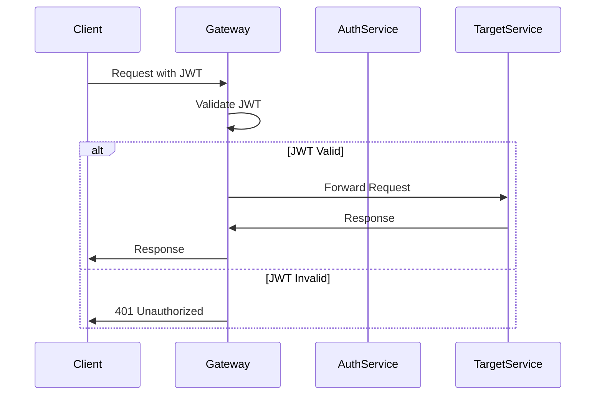

# 🚀 API Gateway - Gasolinera JSM

## 📋 Descripción

El **API Gateway** es el punto de entrada único para todas las peticiones del sistema Gasolinera JSM. Actúa como un proxy inteligente que enruta las peticiones a los microservicios correspondientes, maneja la autenticación JWT, implementa rate limiting, y proporciona observabilidad centralizada.

## 🏗️ Arquitectura

```
┌─────────────────┐    ┌─────────────────┐    ┌─────────────────┐
│   Mobile App    │    │   Web Client    │    │  Third Party    │
│                 │    │                 │    │     APIs        │
└─────────┬───────┘    └─────────┬───────┘    └─────────┬───────┘
          │                      │                      │
          └──────────────────────┼──────────────────────┘
                                 │
                    ┌─────────────────┐
                    │   API Gateway   │
                    │   (Port 8080)   │
                    │                 │
                    │ • JWT Auth      │
                    │ • Rate Limiting │
                    │ • Load Balancing│
                    │ • Circuit Breaker│
                    │ • Observability │
                    └─────────┬───────┘
                              │
          ┌───────────────────┼───────────────────┐
          │                   │                   │
┌─────────▼───────┐ ┌─────────▼───────┐ ┌─────────▼───────┐
│  Auth Service   │ │ Station Service │ │ Coupon Service  │
│   (Port 8081)   │ │   (Port 8083)   │ │   (Port 8084)   │
└─────────────────┘ └─────────────────┘ └─────────────────┘
```

## 🎯 Características Principales

### 🔐 Seguridad

- **JWT Authentication** con validación de tokens
- **Refresh Token** mechanism para renovación automática
- **Rate Limiting** por usuario y endpoint
- **CORS** configurado para múltiples orígenes
- **Security Headers** (HSTS, CSP, X-Frame-Options)

### 🚦 Enrutamiento Inteligente

- **Path-based Routing** a microservicios
- **Load Balancing** con health checks
- **Circuit Breaker** para resilencia
- **Retry Logic** con backoff exponencial
- **Timeout Configuration** por servicio

### 📊 Observabilidad

- **Distributed Tracing** con Jaeger
- **Métricas** de Prometheus integradas
- **Logging Estructurado** con correlation IDs
- **Health Checks** de todos los servicios downstream

## 🛠️ Tecnologías

- **Spring Boot 3.2** - Framework principal
- **Spring Cloud Gateway** - Routing y filtering
- **Spring Security WebFlux** - Seguridad reactiva
- **JWT** - Autenticación stateless
- **Redis** - Cache de sesiones y rate limiting
- **Micrometer** - Métricas y observabilidad
- **Docker** - Containerización

## 🚀 Quick Start

### Prerrequisitos

- Java 21+
- Docker & Docker Compose
- Redis (para cache y rate limiting)

### 1. Clonar y Configurar

```bash
git clone https://github.com/gasolinera-jsm/api-gateway.git
cd api-gateway

# Copiar configuración de ejemplo
cp src/main/resources/application-example.yml src/main/resources/application-local.yml
```

### 2. Configurar Variables de Entorno

```bash
# .env.local
JWT_SECRET=your-super-secret-jwt-key-here
REDIS_HOST=localhost
REDIS_PORT=6379
AUTH_SERVICE_URL=http://localhost:8081
STATION_SERVICE_URL=http://localhost:8083
COUPON_SERVICE_URL=http://localhost:8084
```

### 3. Ejecutar con Docker Compose

```bash
# Levantar dependencias (Redis, etc.)
docker-compose -f docker-compose.dev.yml up -d redis

# Ejecutar la aplicación
./gradlew bootRun --args='--spring.profiles.active=local'
```

### 4. Verificar Funcionamiento

```bash
# Health check
curl http://localhost:8080/actuator/health

# Swagger UI
open http://localhost:8080/swagger-ui.html
```

## 📁 Estructura del Proyecto

```
api-gateway/
├── src/main/kotlin/com/gasolinerajsm/gateway/
│   ├── config/                 # Configuraciones
│   │   ├── GatewayConfig.kt   # Rutas y filtros
│   │   ├── SecurityConfig.kt  # Configuración de seguridad
│   │   ├── RedisConfig.kt     # Configuración de Redis
│   │   └── OpenApiConfig.kt   # Documentación API
│   ├── filter/                # Filtros personalizados
│   │   ├── AuthenticationFilter.kt
│   │   ├── RateLimitFilter.kt
│   │   └── LoggingFilter.kt
│   ├── security/              # Componentes de seguridad
│   │   ├── JwtAuthenticationManager.kt
│   │   ├── JwtTokenProvider.kt
│   │   └── SecurityContextRepository.kt
│   ├── service/               # Servicios
│   │   ├── RateLimitService.kt
│   │   └── HealthCheckService.kt
│   └── GatewayApplication.kt  # Clase principal
├── src/main/resources/
│   ├── application.yml        # Configuración base
│   ├── application-local.yml  # Configuración local
│   ├── application-prod.yml   # Configuración producción
│   └── logback-spring.xml     # Configuración de logs
├── src/test/                  # Tests
├── docker/
│   ├── Dockerfile
│   └── docker-compose.dev.yml
└── build.gradle.kts
```

## ⚙️ Configuración

### Rutas Principales

```yaml
spring:
  cloud:
    gateway:
      routes:
        # Auth Service
        - id: auth-service
          uri: ${AUTH_SERVICE_URL:http://localhost:8081}
          predicates:
            - Path=/api/v1/auth/**
          filters:
            - StripPrefix=0

        # Station Service
        - id: station-service
          uri: ${STATION_SERVICE_URL:http://localhost:8083}
          predicates:
            - Path=/api/v1/stations/**
          filters:
            - StripPrefix=0
            - name: RequestRateLimiter
              args:
                redis-rate-limiter.replenishRate: 100
                redis-rate-limiter.burstCapacity: 200

        # Coupon Service
        - id: coupon-service
          uri: ${COUPON_SERVICE_URL:http://localhost:8084}
          predicates:
            - Path=/api/v1/coupons/**
          filters:
            - StripPrefix=0
            - name: CircuitBreaker
              args:
                name: coupon-service-cb
                fallbackUri: forward:/fallback/coupons
```

### Rate Limiting

```yaml
# Configuración de rate limiting por endpoint
rate-limiting:
  rules:
    - path: '/api/v1/auth/login'
      limit: 5
      window: 900 # 15 minutos
    - path: '/api/v1/coupons/purchase'
      limit: 10
      window: 3600 # 1 hora
    - path: '/api/v1/stations/**'
      limit: 100
      window: 3600 # 1 hora
```

### Circuit Breaker

```yaml
resilience4j:
  circuitbreaker:
    instances:
      coupon-service-cb:
        slidingWindowSize: 10
        failureRateThreshold: 50
        waitDurationInOpenState: 30s
        minimumNumberOfCalls: 5
```

## 🔐 Autenticación y Autorización

### JWT Token Flow



### Roles y Permisos

```kotlin
// Configuración de roles
enum class Role {
    USER,           // Usuario regular
    STATION_OPERATOR, // Operador de estación
    ADMIN           // Administrador del sistema
}

// Endpoints protegidos
@PreAuthorize("hasRole('USER')")
fun purchaseCoupon()

@PreAuthorize("hasRole('STATION_OPERATOR') or hasRole('ADMIN')")
fun updateStationPrices()

@PreAuthorize("hasRole('ADMIN')")
fun getSystemStatistics()
```

## 📊 Monitoreo y Observabilidad

### Métricas Disponibles

- **gateway.requests.total** - Total de requests procesados
- **gateway.requests.duration** - Duración de requests
- **gateway.auth.failures** - Fallos de autenticación
- **gateway.ratelimit.exceeded** - Rate limits excedidos
- **gateway.circuitbreaker.state** - Estado de circuit breakers

### Health Checks

```bash
# Health check general
GET /actuator/health

# Health check detallado (requiere admin)
GET /actuator/health/details

# Métricas de Prometheus
GET /actuator/prometheus
```

### Logs Estructurados

```json
{
  "timestamp": "2024-01-15T10:30:00.000Z",
  "level": "INFO",
  "logger": "com.gasolinerajsm.gateway.filter.LoggingFilter",
  "message": "Request processed",
  "correlationId": "abc123def456",
  "userId": "user123",
  "method": "POST",
  "path": "/api/v1/coupons/purchase",
  "statusCode": 201,
  "duration": 245,
  "userAgent": "GasolineraJSM-Mobile/1.0.0"
}
```

## 🧪 Testing

### Ejecutar Tests

```bash
# Tests unitarios
./gradlew test

# Tests de integración
./gradlew integrationTest

# Tests con coverage
./gradlew jacocoTestReport
```

### Tests de Carga

```bash
# Instalar K6
brew install k6

# Ejecutar tests de carga
k6 run src/test/k6/load-test.js
```

## 🐳 Docker

### Build de Imagen

```bash
# Build local
docker build -t gasolinera-jsm/api-gateway:latest .

# Build multi-platform
docker buildx build --platform linux/amd64,linux/arm64 -t gasolinera-jsm/api-gateway:latest .
```

### Docker Compose

```bash
# Desarrollo
docker-compose -f docker-compose.dev.yml up

# Producción
docker-compose -f docker-compose.prod.yml up -d
```

## 🚀 Deployment

### Variables de Entorno Requeridas

```bash
# JWT Configuration
JWT_SECRET=your-jwt-secret-key
JWT_EXPIRATION=3600
JWT_REFRESH_EXPIRATION=604800

# Redis Configuration
REDIS_HOST=redis-cluster.example.com
REDIS_PORT=6379
REDIS_PASSWORD=your-redis-password

# Service URLs
AUTH_SERVICE_URL=http://auth-service:8081
STATION_SERVICE_URL=http://station-service:8083
COUPON_SERVICE_URL=http://coupon-service:8084

# Observability
JAEGER_ENDPOINT=http://jaeger:14268/api/traces
PROMETHEUS_ENABLED=true
```

### Kubernetes Deployment

```bash
# Aplicar manifests
kubectl apply -f k8s/

# Verificar deployment
kubectl get pods -l app=api-gateway
kubectl logs -f deployment/api-gateway
```

## 🔧 Troubleshooting

### Problemas Comunes

#### 1. JWT Token Inválido

```bash
# Verificar configuración JWT
curl -H "Authorization: Bearer invalid-token" http://localhost:8080/api/v1/stations/nearby

# Respuesta esperada: 401 Unauthorized
```

#### 2. Rate Limit Excedido

```bash
# Verificar rate limits en Redis
redis-cli
> KEYS rate_limit:*
> GET rate_limit:user123:/api/v1/auth/login
```

#### 3. Circuit Breaker Abierto

```bash
# Verificar estado de circuit breakers
curl http://localhost:8080/actuator/circuitbreakers
```

#### 4. Servicio Downstream No Disponible

```bash
# Verificar health de servicios
curl http://localhost:8080/actuator/health/details
```

### Logs de Debug

```yaml
# application-debug.yml
logging:
  level:
    com.gasolinerajsm.gateway: DEBUG
    org.springframework.cloud.gateway: DEBUG
    org.springframework.security: DEBUG
```

## 📚 Referencias

- [Spring Cloud Gateway Documentation](https://spring.io/projects/spring-cloud-gateway)
- [Spring Security WebFlux](https://docs.spring.io/spring-security/reference/reactive/index.html)
- [JWT.io](https://jwt.io/) - JWT Debugger
- [Redis Rate Limiting](https://redis.io/docs/manual/patterns/distributed-locks/)

## 🤝 Contribución

1. Fork el repositorio
2. Crear feature branch (`git checkout -b feature/amazing-feature`)
3. Commit cambios (`git commit -m 'Add amazing feature'`)
4. Push al branch (`git push origin feature/amazing-feature`)
5. Crear Pull Request

## 📄 Licencia

Este proyecto es propiedad de Gasolinera JSM. Todos los derechos reservados.

---

**🚀 ¿Necesitas ayuda?**

- 📧 Email: dev@gasolinera-jsm.com
- 💬 Slack: #api-gateway-support
- 📖 Docs: https://docs.gasolinera-jsm.com

_Última actualización: Enero 2024_
