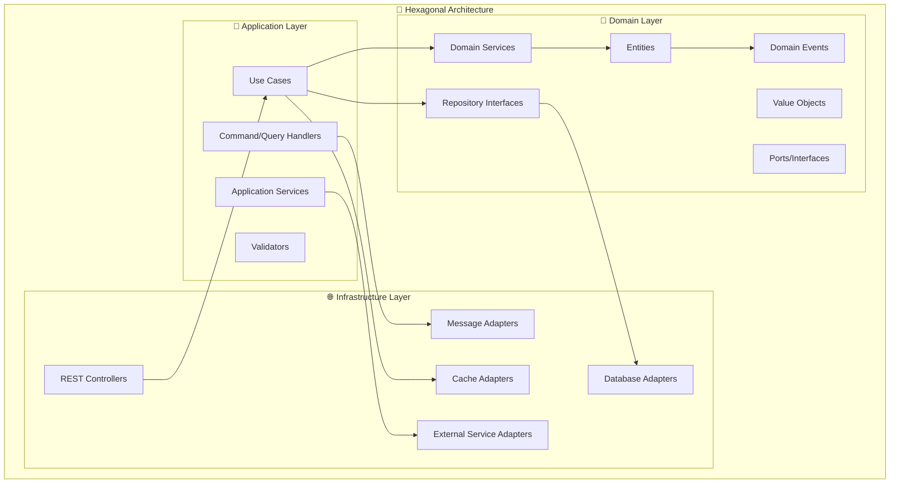
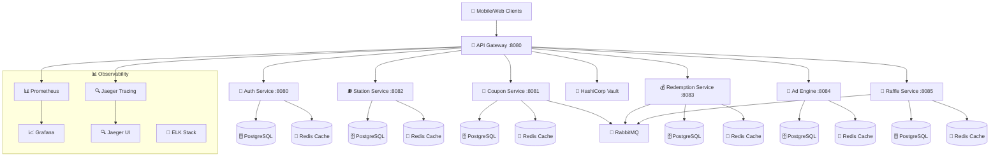
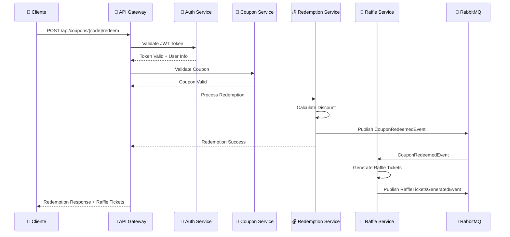
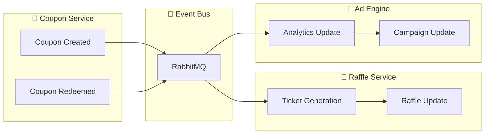

# 🏗️ Arquitectura - Gasolinera JSM Platform

## 📋 Tabla de Contenidos

- [Visión General](#visión-general)
- [Arquitectura Hexagonal](#arquitectura-hexagonal)
- [Microservicios](#microservicios)
- [Patrones de Diseño](#patrones-de-diseño)
- [Flujo de Datos](#flujo-de-datos)
- [Decisiones Arquitectónicas](#decisiones-arquitectónicas)

## 🎯 Visión General

La plataforma Gasolinera JSM está construida siguiendo los principios de **Domain-Driven Design (DDD)** y **Arquitectura Hexagonal**, implementada como un ecosistema de microservicios que garantiza escalabilidad, mantenibilidad y testabilidad.

### Principios Arquitectónicos

1. **Separación de Responsabilidades**: Cada servicio tiene una responsabilidad específica
2. **Inversión de Dependencias**: Las dependencias apuntan hacia el dominio
3. **Testabilidad**: Arquitectura que facilita testing unitario e integración
4. **Escalabilidad**: Servicios independientes que escalan según demanda
5. **Observabilidad**: Métricas, logs y trazas en todos los niveles

## 🔷 Arquitectura Hexagonal

Cada microservicio implementa arquitectura hexagonal con tres capas principales:



### Capas y Responsabilidades

#### 💎 Domain Layer (Núcleo)

- **Entities**: Objetos de negocio con identidad y ciclo de vida
- **Value Objects**: Objetos inmutables que representan conceptos del dominio
- **Domain Services**: Lógica de negocio que no pertenece a una entidad específica
- **Repository Interfaces**: Contratos para persistencia
- **Domain Events**: Eventos que representan cambios importantes en el dominio

#### 🎯 Application Layer (Orquestación)

- **Use Cases**: Casos de uso específicos de la aplicación
- **Command/Query Handlers**: Manejo de comandos y consultas
- **Application Services**: Servicios de aplicación que coordinan el flujo
- **DTOs**: Objetos de transferencia de datos

#### 🌐 Infrastructure Layer (Detalles Técnicos)

- **REST Controllers**: Endpoints HTTP
- **Database Adapters**: Implementaciones de repositorios
- **Message Adapters**: Integración con sistemas de mensajería
- **Cache Adapters**: Integración con sistemas de caché
- **External Service Adapters**: Integración con servicios externos

## 🏢 Microservicios

### Diagrama de Sistema



### Servicios y Responsabilidades

| Servicio                  | Puerto | Dominio       | Responsabilidades                  |
| ------------------------- | ------ | ------------- | ---------------------------------- |
| **🔐 Auth Service**       | 8080   | Autenticación | JWT, RBAC, Usuarios, Sesiones      |
| **🎫 Coupon Service**     | 8081   | Cupones       | Generación, Validación, QR Codes   |
| **⛽ Station Service**    | 8082   | Estaciones    | Gestión de estaciones, Ubicaciones |
| **💰 Redemption Service** | 8083   | Redenciones   | Procesamiento, Tickets de rifa     |
| **📢 Ad Engine**          | 8084   | Publicidad    | Campañas, Targeting, Analytics     |
| **🎰 Raffle Service**     | 8085   | Rifas         | Sorteos, Premios, Ganadores        |

## 🎨 Patrones de Diseño

### 1. Repository Pattern

```kotlin
// Domain Layer - Interface
interface CouponRepository {
    suspend fun save(coupon: Coupon): Result<Coupon>
    suspend fun findById(id: CouponId): Result<Coupon?>
    suspend fun findByStatus(status: CouponStatus): Result<List<Coupon>>
}

// Infrastructure Layer - Implementation
@Repository
class JpaCouponRepository(
    private val jpaRepository: CouponJpaRepository
) : CouponRepository {
    override suspend fun save(coupon: Coupon): Result<Coupon> {
        return try {
            val entity = coupon.toJpaEntity()
            val saved = jpaRepository.save(entity)
            Result.success(saved.toDomainEntity())
        } catch (e: Exception) {
            Result.failure(RepositoryException("Failed to save coupon", e))
        }
    }
}
```

### 2. Factory Pattern

```kotlin
// Domain Layer
class CouponFactory {
    fun createDiscountCoupon(
        campaignId: CampaignId,
        discountAmount: Money,
        validityPeriod: DateRange
    ): Coupon {
        return Coupon(
            id = CouponId.generate(),
            campaignId = campaignId,
            type = CouponType.DISCOUNT,
            discountAmount = discountAmount,
            validityPeriod = validityPeriod,
            status = CouponStatus.ACTIVE,
            createdAt = Clock.System.now()
        )
    }

    fun createPercentageCoupon(
        campaignId: CampaignId,
        discountPercentage: Percentage,
        validityPeriod: DateRange
    ): Coupon {
        return Coupon(
            id = CouponId.generate(),
            campaignId = campaignId,
            type = CouponType.PERCENTAGE,
            discountPercentage = discountPercentage,
            validityPeriod = validityPeriod,
            status = CouponStatus.ACTIVE,
            createdAt = Clock.System.now()
        )
    }
}
```

### 3. Strategy Pattern

```kotlin
// Domain Layer
interface DiscountStrategy {
    fun calculateDiscount(originalAmount: Money, coupon: Coupon): Money
}

class FixedAmountDiscountStrategy : DiscountStrategy {
    override fun calculateDiscount(originalAmount: Money, coupon: Coupon): Money {
        return coupon.discountAmount ?: Money.ZERO
    }
}

class PercentageDiscountStrategy : DiscountStrategy {
    override fun calculateDiscount(originalAmount: Money, coupon: Coupon): Money {
        val percentage = coupon.discountPercentage ?: Percentage.ZERO
        return originalAmount * (percentage.value / 100.0)
    }
}

// Application Layer
class DiscountCalculatorService {
    private val strategies = mapOf(
        CouponType.DISCOUNT to FixedAmountDiscountStrategy(),
        CouponType.PERCENTAGE to PercentageDiscountStrategy()
    )

    fun calculateDiscount(originalAmount: Money, coupon: Coupon): Money {
        val strategy = strategies[coupon.type]
            ?: throw IllegalArgumentException("Unknown coupon type: ${coupon.type}")
        return strategy.calculateDiscount(originalAmount, coupon)
    }
}
```

### 4. Command Pattern (CQRS)

```kotlin
// Application Layer
data class CreateCouponCommand(
    val campaignId: String,
    val type: String,
    val discountAmount: BigDecimal?,
    val discountPercentage: BigDecimal?,
    val validFrom: LocalDateTime,
    val validUntil: LocalDateTime
)

data class CouponQuery(
    val id: String? = null,
    val campaignId: String? = null,
    val status: String? = null,
    val userId: String? = null
)

class CreateCouponUseCase(
    private val repository: CouponRepository,
    private val factory: CouponFactory,
    private val eventPublisher: DomainEventPublisher
) {
    suspend fun execute(command: CreateCouponCommand): Result<CouponResponse> {
        return try {
            val coupon = factory.createFromCommand(command)

            repository.save(coupon)
                .onSuccess { savedCoupon ->
                    eventPublisher.publish(CouponCreatedEvent(savedCoupon.id))
                }
                .map { it.toResponse() }
        } catch (e: Exception) {
            Result.failure(BusinessException("Failed to create coupon", e))
        }
    }
}
```

### 5. Observer Pattern (Domain Events)

```kotlin
// Domain Layer
sealed class DomainEvent {
    abstract val aggregateId: String
    abstract val occurredOn: Instant
}

data class CouponCreatedEvent(
    override val aggregateId: String,
    override val occurredOn: Instant = Clock.System.now(),
    val campaignId: String,
    val couponType: CouponType
) : DomainEvent()

data class CouponRedeemedEvent(
    override val aggregateId: String,
    override val occurredOn: Instant = Clock.System.now(),
    val userId: String,
    val stationId: String,
    val discountApplied: Money
) : DomainEvent()

// Application Layer
interface DomainEventPublisher {
    suspend fun publish(event: DomainEvent)
    suspend fun publishAll(events: List<DomainEvent>)
}

@Component
class RabbitMQEventPublisher(
    private val rabbitTemplate: RabbitTemplate
) : DomainEventPublisher {

    override suspend fun publish(event: DomainEvent) {
        val routingKey = event::class.simpleName?.lowercase() ?: "unknown"
        rabbitTemplate.convertAndSend("domain.events", routingKey, event)
    }
}
```

## 🔄 Flujo de Datos

### Flujo Principal: Redención de Cupón



### Flujo de Eventos Asíncronos



## 🎯 Decisiones Arquitectónicas

### ADR-001: Arquitectura Hexagonal

**Decisión**: Implementar arquitectura hexagonal en todos los microservicios

**Contexto**: Necesitamos una arquitectura que permita:

- Testabilidad alta
- Separación clara de responsabilidades
- Independencia de frameworks externos
- Facilidad de mantenimiento

**Consecuencias**:

- ✅ Mayor testabilidad
- ✅ Código más mantenible
- ✅ Independencia de tecnologías
- ❌ Mayor complejidad inicial
- ❌ Curva de aprendizaje

### ADR-002: Event-Driven Architecture

**Decisión**: Usar eventos de dominio para comunicación asíncrona

**Contexto**: Los microservicios necesitan comunicarse sin acoplamiento directo

**Consecuencias**:

- ✅ Desacoplamiento entre servicios
- ✅ Escalabilidad mejorada
- ✅ Resilencia ante fallos
- ❌ Complejidad en debugging
- ❌ Eventual consistency

### ADR-003: CQRS Pattern

**Decisión**: Separar comandos y consultas en casos de uso complejos

**Contexto**: Algunos casos de uso requieren optimizaciones diferentes para lectura y escritura

**Consecuencias**:

- ✅ Optimización independiente
- ✅ Escalabilidad mejorada
- ✅ Separación de responsabilidades
- ❌ Complejidad adicional
- ❌ Duplicación de modelos

### ADR-004: Database per Service

**Decisión**: Cada microservicio tiene su propia base de datos

**Contexto**: Necesitamos independencia de datos entre servicios

**Consecuencias**:

- ✅ Independencia de servicios
- ✅ Tecnologías específicas por servicio
- ✅ Escalabilidad independiente
- ❌ Complejidad en transacciones distribuidas
- ❌ Duplicación de datos

## 🔍 Patrones de Observabilidad

### Correlation IDs

```kotlin
@Component
class CorrelationIdFilter : Filter {
    override fun doFilter(request: ServletRequest, response: ServletResponse, chain: FilterChain) {
        val correlationId = request.getHeader("X-Correlation-ID") ?: UUID.randomUUID().toString()

        MDC.put("correlationId", correlationId)
        response.setHeader("X-Correlation-ID", correlationId)

        try {
            chain.doFilter(request, response)
        } finally {
            MDC.clear()
        }
    }
}
```

### Circuit Breaker

```kotlin
@Component
class ExternalServiceClient {

    @CircuitBreaker(name = "external-service", fallbackMethod = "fallbackMethod")
    @Retry(name = "external-service")
    @TimeLimiter(name = "external-service")
    suspend fun callExternalService(request: ExternalRequest): ExternalResponse {
        // External service call
    }

    suspend fun fallbackMethod(request: ExternalRequest, exception: Exception): ExternalResponse {
        logger.warn("Circuit breaker activated for external service", exception)
        return ExternalResponse.empty()
    }
}
```

## 📊 Métricas y Monitoreo

### Métricas de Negocio

- Cupones generados por campaña
- Tasa de redención de cupones
- Tickets de rifa generados
- Revenue por estación
- Conversión de campañas publicitarias

### Métricas Técnicas

- Latencia de endpoints (P50, P95, P99)
- Throughput por servicio
- Error rates por endpoint
- Utilización de recursos (CPU, memoria)
- Conexiones de base de datos activas

### Health Checks

```kotlin
@Component
class CustomHealthIndicator : HealthIndicator {
    override fun health(): Health {
        return try {
            // Check database connectivity
            val dbStatus = checkDatabaseHealth()
            // Check cache connectivity
            val cacheStatus = checkCacheHealth()
            // Check message queue
            val queueStatus = checkQueueHealth()

            if (dbStatus && cacheStatus && queueStatus) {
                Health.up()
                    .withDetail("database", "UP")
                    .withDetail("cache", "UP")
                    .withDetail("messageQueue", "UP")
                    .build()
            } else {
                Health.down()
                    .withDetail("database", if (dbStatus) "UP" else "DOWN")
                    .withDetail("cache", if (cacheStatus) "UP" else "DOWN")
                    .withDetail("messageQueue", if (queueStatus) "UP" else "DOWN")
                    .build()
            }
        } catch (e: Exception) {
            Health.down()
                .withDetail("error", e.message)
                .build()
        }
    }
}
```

Esta arquitectura garantiza un sistema robusto, escalable y mantenible que puede evolucionar con las necesidades del negocio mientras mantiene altos estándares de calidad y rendimiento.
