# 🔄 Data Flow Diagrams - Gasolinera JSM

## 📋 Overview

Este documento describe los flujos de datos principales en el sistema Gasolinera JSM, mostrando cómo la información se mueve entre servicios, bases de datos y sistemas externos siguiendo los principios de arquitectura hexagonal.

## 🎯 Core Business Flows

### 1. User Registration & Authentication Flow

```mermaid
sequenceDiagram
    participant User as 👤 User
    participant Mobile as 📱 Mobile App
    participant Gateway as 🚪 API Gateway
    participant Auth as 🔐 Auth Service
    participant DB as 🗄️ PostgreSQL
    participant Redis as 🔴 Redis Cache
    participant Vault as 🔐 Vault
    participant SMTP as 📧 Email Service

    User->>Mobile: Register Account
    Mobile->>Gateway: POST /api/v1/auth/register
    Gateway->>Auth: Forward Registration

    Auth->>DB: Check Email Exists
    DB-->>Auth: Email Available

    Auth->>Vault: Get JWT Keys
    Vault-->>Auth: Private/Public Keys

    Auth->>DB: Create User Record
    DB-->>Auth: User Created

    Auth->>Auth: Generate JWT Tokens
    Auth->>Redis: Store Refresh Token
    Redis-->>Auth: Token Stored

    Auth->>SMTP: Send Verification Email
    SMTP-->>Auth: Email Sent

    Auth-->>Gateway: Registration Success + Tokens
    Gateway-->>Mobile: User Created Response
    Mobile-->>User: Registration Complete

    Note over User,SMTP: Email Verification Flow
    User->>Mobile: Click Verification Link
    Mobile->>Gateway: GET /api/v1/auth/verify/{token}
    Gateway->>Auth: Verify Email Token
    Auth->>DB: Update User Verified Status
    DB-->>Auth: User Verified
    Auth-->>Gateway: Verification Success
    Gateway-->>Mobile: Account Verified
    Mobile-->>User: Account Active
```

### 2. Station Search & Discovery Flow


### 3. Coupon Purchase Flow

```mermaid
sequenceDiagram
    participant User as 👤 User
    participant Mobile as 📱 Mobile App
    participant Gateway as 🚪 API Gateway
    participant Coupon as 🎫 Coupon Service
    participant Auth as 🔐 Auth Service
    participant Payment as 💳 Payment Gateway
    participant DB as 🗄️ PostgreSQL
    participant Redis as 🔴 Redis Cache
    participant Queue as 🐰 RabbitMQ
    participant Raffle as 🎰 Raffle Service

    User->>Mobile: Select Station & Amount
    Mobile->>Gateway: POST /api/v1/coupons/purchase
    Gateway->>Auth: Validate JWT Token
    Auth-->>Gateway: Token Valid + User Info

    Gateway->>Coupon: Create Coupon Request

    Note over Coupon: Domain Validation
    Coupon->>Coupon: Validate Business Rules
    Coupon->>DB: Check User Active Coupons
    DB-->>Coupon: Current Coupon Count

    alt Validation Passes
        Coupon->>Payment: Process Payment
        Payment->>Payment: Charge Credit Card
        Payment-->>Coupon: Payment Successful

        Coupon->>Coupon: Generate QR Code
        Coupon->>DB: Save Coupon Record
        DB-->>Coupon: Coupon Saved

        Coupon->>Redis: Cache Coupon Data
        Redis-->>Coupon: Cached

        Coupon->>Queue: Publish CouponCreated Event
        Queue->>Raffle: Handle CouponCreated
        Raffle->>Raffle: Generate Initial Tickets
        Raffle->>DB: Save Raffle Tickets

        Coupon-->>Gateway: Coupon Created Response
        Gateway-->>Mobile: Purchase Success + QR Code
        Mobile-->>User: Show Coupon Details

    else Validation Fails
        Coupon-->>Gateway: Validation Error
        Gateway-->>Mobile: Error Response
        Mobile-->>User: Show Error Message
    end
```

### 4. Coupon Redemption Flow

```mermaid
sequenceDiagram
    participant Attendant as 👨‍🔧 Gas Station Attendant
    participant Scanner as 📱 Scanner App
    participant Gateway as 🚪 API Gateway
    participant Coupon as 🎫 Coupon Service
    participant Station as ⛽ Station Service
    participant DB as 🗄️ PostgreSQL
    participant Redis as 🔴 Redis Cache
    participant Queue as 🐰 RabbitMQ
    participant Raffle as 🎰 Raffle Service
    participant User as 👤 User Mobile

    Attendant->>Scanner: Scan QR Code
    Scanner->>Gateway: POST /api/v1/coupons/redeem
    Gateway->>Coupon: Redeem Coupon Request

    Coupon->>Redis: Check Coupon Cache
    Redis-->>Coupon: Cache Hit - Coupon Data

    Note over Coupon: Validation Chain
    Coupon->>Coupon: Validate QR Signature
    Coupon->>Coupon: Check Expiration
    Coupon->>Coupon: Verify Station Match
    Coupon->>Coupon: Check Fuel Amount

    alt All Validations Pass
        Coupon->>DB: Begin Transaction
        Coupon->>DB: Update Coupon Status
        Coupon->>DB: Create Redemption Record
        DB-->>Coupon: Transaction Committed

        Coupon->>Redis: Update Cache
        Coupon->>Redis: Invalidate Related Caches

        Coupon->>Queue: Publish CouponRedeemed Event

        Note over Queue,Raffle: Async Processing
        Queue->>Raffle: Handle CouponRedeemed
        Raffle->>Raffle: Calculate Ticket Multiplier
        Raffle->>DB: Generate Additional Tickets
        Raffle->>Queue: Publish TicketsGenerated Event

        Queue->>User: Send Push Notification

        Coupon-->>Gateway: Redemption Success
        Gateway-->>Scanner: Fuel Authorization
        Scanner-->>Attendant: Approve Fuel Dispensing

    else Validation Fails
        Coupon-->>Gateway: Redemption Error
        Gateway-->>Scanner: Error Details
        Scanner-->>Attendant: Show Error Message
    end
```

### 5. Raffle Draw & Winner Selection Flow

```mermaid
sequenceDiagram
    participant Scheduler as ⏰ Cron Scheduler
    participant Raffle as 🎰 Raffle Service
    participant DB as 🗄️ PostgreSQL
    participant Redis as 🔴 Redis Cache
    participant Queue as 🐰 RabbitMQ
    participant Notification as 📧 Notification Service
    participant Winners as 🏆 Winners

    Note over Scheduler: Daily at 8:00 PM
    Scheduler->>Raffle: Trigger Daily Draw

    Raffle->>DB: Get Active Raffles
    DB-->>Raffle: Raffle List

    loop For Each Active Raffle
        Raffle->>DB: Get All Valid Tickets
        DB-->>Raffle: Ticket Pool

        Raffle->>Raffle: Apply Weighted Random Selection
        Note over Raffle: Algorithm considers ticket multipliers

        Raffle->>Raffle: Select Winners
        Raffle->>DB: Record Winners
        DB-->>Raffle: Winners Saved

        Raffle->>Redis: Cache Winner Results
        Redis-->>Raffle: Cached

        Raffle->>Queue: Publish WinnersSelected Event
    end

    Note over Queue,Winners: Winner Notification Flow
    Queue->>Notification: Handle WinnersSelected

    loop For Each Winner
        Notification->>DB: Get Winner Contact Info
        DB-->>Notification: User Details

        Notification->>Notification: Generate Winner Message
        Notification->>Queue: Send Push Notification
        Notification->>Queue: Send Email Notification
        Notification->>Queue: Send SMS Notification

        Queue-->>Winners: Push Notification
        Queue-->>Winners: Email Notification
        Queue-->>Winners: SMS Notification
    end

    Note over Raffle: Update Raffle Status
    Raffle->>DB: Mark Raffle as Completed
    Raffle->>Redis: Update Cache
```

## 📊 Data Architecture Patterns

### 1. Cache-Aside Pattern (Station Prices)

```mermaid
graph TB
    subgraph "Cache-Aside Flow"
        App[📱 Application]
        Cache[🔴 Redis Cache]
        DB[🗄️ PostgreSQL]

        App -->|1. Check Cache| Cache
        Cache -->|2. Cache Miss| App
        App -->|3. Query Database| DB
        DB -->|4. Return Data| App
        App -->|5. Update Cache| Cache
        App -->|6. Return to Client| Client[👤 Client]
    end
```

**Implementation:**

```kotlin
@Service
class StationPriceService(
    private val stationRepository: StationRepository,
    private val redisTemplate: RedisTemplate<String, Any>
) {
    suspend fun getCurrentPrices(stationId: UUID): Map<FuelType, BigDecimal> {
        val cacheKey = "station:prices:$stationId"

        // 1. Check cache first
        val cachedPrices = redisTemplate.opsForValue().get(cacheKey)
        if (cachedPrices != null) {
            return cachedPrices as Map<FuelType, BigDecimal>
        }

        // 2. Cache miss - query database
        val station = stationRepository.findById(stationId)
        val prices = station?.fuelPrices ?: emptyMap()

        // 3. Update cache with TTL
        redisTemplate.opsForValue().set(cacheKey, prices, Duration.ofMinutes(15))

        return prices
    }
}
```

### 2. Write-Through Pattern (Coupon Updates)

```mermaid
graph TB
    subgraph "Write-Through Flow"
        App[📱 Application]
        Cache[🔴 Redis Cache]
        DB[🗄️ PostgreSQL]

        App -->|1. Write Data| Cache
        Cache -->|2. Write to DB| DB
        DB -->|3. Confirm Write| Cache
        Cache -->|4. Confirm to App| App
        App -->|5. Return Success| Client[👤 Client]
    end
```

### 3. Event-Driven Data Synchronization

```mermaid
graph TB
    subgraph "Event-Driven Sync"
        Service1[🎫 Coupon Service]
        Queue[🐰 RabbitMQ]
        Service2[🎰 Raffle Service]
        Service3[📊 Dashboard Service]

        Service1 -->|Publish Event| Queue
        Queue -->|Route Event| Service2
        Queue -->|Route Event| Service3

        Service2 -->|Update Local Data| DB2[🗄️ Raffle DB]
        Service3 -->|Update Analytics| DB3[🗄️ Analytics DB]
    end
```

## 🔄 Cross-Service Communication Patterns

### 1. Synchronous Communication (API Calls)


### 2. Asynchronous Communication (Events)


### 3. Hybrid Pattern (Command + Event)

```mermaid
sequenceDiagram
    participant Client as 👤 Client
    participant ServiceA as Service A
    participant ServiceB as Service B
    participant Queue as 🐰 Queue
    participant ServiceC as Service C

    Client->>ServiceA: Synchronous Command
    ServiceA->>ServiceB: Synchronous Validation
    ServiceB-->>ServiceA: Validation Result
    ServiceA->>ServiceA: Process Command
    ServiceA-->>Client: Immediate Response

    ServiceA->>Queue: Async Event
    Queue->>ServiceC: Process Event
    ServiceC->>ServiceC: Background Processing
```

## 📈 Performance Optimization Patterns

### 1. Database Query Optimization

```sql
-- Spatial query optimization for station search
EXPLAIN (ANALYZE, BUFFERS)
SELECT
    s.id, s.name, s.address, s.fuel_prices,
    ST_Distance(s.location, ST_Point($1, $2)) as distance
FROM stations s
WHERE ST_DWithin(s.location, ST_Point($1, $2), $3)
  AND s.status = 'ACTIVE'
  AND s.fuel_prices ? $4  -- JSON key exists
ORDER BY distance
LIMIT $5;

-- Index for optimization
CREATE INDEX CONCURRENTLY idx_stations_location_active
ON stations USING GIST(location)
WHERE status = 'ACTIVE';
```

### 2. Connection Pool Optimization

```yaml
# HikariCP Configuration
spring:
  datasource:
    hikari:
      maximum-pool-size: 20
      minimum-idle: 5
      idle-timeout: 300000 # 5 minutes
      max-lifetime: 1200000 # 20 minutes
      connection-timeout: 20000 # 20 seconds
      leak-detection-threshold: 60000 # 1 minute
```

### 3. Redis Pipeline Optimization

```kotlin
@Service
class OptimizedCacheService(
    private val redisTemplate: RedisTemplate<String, Any>
) {
    suspend fun batchUpdatePrices(stationPrices: Map<UUID, Map<FuelType, BigDecimal>>) {
        redisTemplate.executePipelined { connection ->
            stationPrices.forEach { (stationId, prices) ->
                val key = "station:prices:$stationId"
                connection.setEx(key.toByteArray(), 900, serialize(prices)) // 15 min TTL
            }
            null
        }
    }
}
```

## 🔐 Security Data Flow

### 1. JWT Token Flow

```mermaid
sequenceDiagram
    participant Client as 👤 Client
    participant Gateway as 🚪 API Gateway
    participant Auth as 🔐 Auth Service
    participant Vault as 🔐 Vault
    participant Service as 🎯 Business Service

    Client->>Gateway: Request with JWT
    Gateway->>Vault: Get Public Key
    Vault-->>Gateway: RSA Public Key
    Gateway->>Gateway: Validate JWT Signature
    Gateway->>Gateway: Check Token Expiration
    Gateway->>Gateway: Extract User Claims

    alt Token Valid
        Gateway->>Service: Forward Request + User Context
        Service->>Service: Process Business Logic
        Service-->>Gateway: Business Response
        Gateway-->>Client: Success Response
    else Token Invalid
        Gateway-->>Client: 401 Unauthorized
    end
```

### 2. Secret Management Flow

```mermaid
graph TB
    subgraph "Secret Management"
        App[📱 Application]
        Vault[🔐 HashiCorp Vault]
        DB[🗄️ Database]
        External[🔌 External API]

        App -->|1. Request Secret| Vault
        Vault -->|2. Dynamic Secret| App
        App -->|3. Use Secret| DB
        App -->|4. Use API Key| External

        Vault -->|Auto Rotate| Vault
        Vault -->|Audit Log| AuditLog[📋 Audit Log]
    end
```

## 📊 Monitoring Data Flow

### 1. Metrics Collection

```mermaid
graph TB
    subgraph "Metrics Flow"
        Services[🎯 Services]
        Prometheus[📊 Prometheus]
        Grafana[📈 Grafana]
        AlertManager[🚨 Alert Manager]

        Services -->|Expose /metrics| Prometheus
        Prometheus -->|Scrape Metrics| Prometheus
        Prometheus -->|Query Data| Grafana
        Prometheus -->|Trigger Alerts| AlertManager
        AlertManager -->|Send Notifications| Slack[💬 Slack]
        AlertManager -->|Send Notifications| Email[📧 Email]
    end
```

### 2. Distributed Tracing

```mermaid
sequenceDiagram
    participant Client as 👤 Client
    participant Gateway as 🚪 Gateway
    participant ServiceA as Service A
    participant ServiceB as Service B
    participant Jaeger as 🔍 Jaeger

    Client->>Gateway: Request (Trace-ID: abc123)
    Gateway->>ServiceA: Forward (Trace-ID: abc123, Span-ID: def456)
    ServiceA->>ServiceB: Call (Trace-ID: abc123, Span-ID: ghi789)

    ServiceB->>Jaeger: Send Span
    ServiceA->>Jaeger: Send Span
    Gateway->>Jaeger: Send Span

    ServiceB-->>ServiceA: Response
    ServiceA-->>Gateway: Response
    Gateway-->>Client: Response
```

### 3. Log Aggregation

```mermaid
graph TB
    subgraph "Logging Flow"
        Services[🎯 Services]
        Filebeat[📝 Filebeat]
        Elasticsearch[🔍 Elasticsearch]
        Kibana[📊 Kibana]

        Services -->|JSON Logs| Filebeat
        Filebeat -->|Ship Logs| Elasticsearch
        Elasticsearch -->|Index Logs| Elasticsearch
        Elasticsearch -->|Query Logs| Kibana
        Kibana -->|Visualize| Dashboard[📈 Dashboard]
    end
```

## 🎯 Data Consistency Patterns

### 1. Eventual Consistency (Cross-Service)

```mermaid
sequenceDiagram
    participant CouponService as 🎫 Coupon Service
    participant EventBus as 🐰 Event Bus
    participant RaffleService as 🎰 Raffle Service
    participant DashboardService as 📊 Dashboard Service

    Note over CouponService: Coupon Redeemed
    CouponService->>EventBus: Publish CouponRedeemed Event

    EventBus->>RaffleService: Deliver Event
    RaffleService->>RaffleService: Generate Tickets
    RaffleService->>EventBus: Publish TicketsGenerated Event

    EventBus->>DashboardService: Deliver CouponRedeemed Event
    DashboardService->>DashboardService: Update Analytics

    EventBus->>DashboardService: Deliver TicketsGenerated Event
    DashboardService->>DashboardService: Update Ticket Stats

    Note over CouponService,DashboardService: Eventually Consistent State
```

### 2. Strong Consistency (Within Service)


---

**🔄 Estos diagramas de flujo de datos proporcionan una comprensión completa de cómo la información se mueve a través del ecosistema Gasolinera JSM, manteniendo los principios de arquitectura hexagonal y garantizando performance, seguridad y confiabilidad.**

_Última actualización: Enero 2024_
