# 🏗️ Hexagonal Architecture Patterns - Gasolinera JSM

## 📋 Overview

Esta guía documenta los patrones de arquitectura hexagonal implementados en todos los servicios de Gasolinera JSM. La arquitectura hexagonal (también conocida como Ports & Adapters) nos permite mantener la lógica de negocio completamente aislada de las preocupaciones de infraestructura.

## 🎯 Principios Fundamentales

### 1. **Separación de Responsabilidades**

```mermaid
graph TB
    subgraph "External World"
        UI[🌐 User Interface]
        DB[🗄️ Database]
        API[🔌 External APIs]
        MQ[🐰 Message Queue]
    end

    subgraph "Hexagonal Service"
        subgraph "Adapters (Infrastructure)"
            WebAdapter[🌐 Web Controllers]
            DBAdapter[🗄️ JPA Repositories]
            APIAdapter[🔌 HTTP Clients]
            MQAdapter[🐰 Message Publishers]
        end

        subgraph "Ports (Interfaces)"
            InboundPorts[📥 Use Case Interfaces]
            OutboundPorts[📤 Repository Interfaces]
        end

        subgraph "Core (Domain)"
            Entities[🏛️ Entities]
            ValueObjects[💎 Value Objects]
            DomainServices[⚙️ Domain Services]
            UseCases[🎯 Use Cases]
        end
    end

    UI --> WebAdapter
    WebAdapter --> InboundPorts
    InboundPorts --> UseCases
    UseCases --> DomainServices
    UseCases --> OutboundPorts
    OutboundPorts --> DBAdapter
    DBAdapter --> DB

    API --> APIAdapter
    APIAdapter --> OutboundPorts

    MQAdapter --> MQ
    OutboundPorts --> MQAdapter
```



### 2. **Inversión de Dependencias**

- El dominio NO depende de la infraestructura
- La infraestructura depende del dominio
- Las interfaces (ports) definen los contratos
- Los adapters implementan las interfaces

## 🏛️ Estructura de Capas

### Domain Layer (Core)

La capa de dominio contiene la lógica de negocio pura, sin dependencias externas.

```kotlin
// 📁 src/main/kotlin/com/gasolinerajsm/coupon/domain/

// Entities - Objetos con identidad y ciclo de vida
data class Coupon(
    val id: CouponId,
    val userId: UserId,
    val stationId: StationId,
    val amount: Money,
    val fuelType: FuelType,
    val qrCode: QRCode,
    val status: CouponStatus,
    val validFrom: LocalDateTime,
    val validUntil: LocalDateTime,
    private val domainEvents: MutableList<DomainEvent> = mutableListOf()
) {
    companion object {
        fun create(
            userId: UserId,
            stationId: StationId,
            amount: Money,
            fuelType: FuelType,
            validityPeriod: Duration
        ): Coupon {
            val coupon = Coupon(
                id = CouponId.generate(),
                userId = userId,
                stationId = stationId,
                amount = amount,
                fuelType = fuelType,
                qrCode = QRCode.generate(),
                status = CouponStatus.ACTIVE,
                validFrom = LocalDateTime.now(),
                validUntil = LocalDateTime.now().plus(validityPeriod)
            )

            coupon.addDomainEvent(
                CouponCreatedEvent(
                    couponId = coupon.id,
                    userId = userId,
                    amount = amount,
                    occurredAt = LocalDateTime.now()
                )
            )

            return coupon
        }
    }

    fun redeem(redemptionLocation: Location, fuelAmount: FuelAmount): RedemptionResult {
        return when {
            status != CouponStatus.ACTIVE ->
                RedemptionResult.Failure("Coupon is not active")
            LocalDateTime.now().isAfter(validUntil) ->
                RedemptionResult.Failure("Coupon has expired")
            fuelAmount.value > amount.calculateMaxFuel(fuelType) ->
                RedemptionResult.Failure("Insufficient coupon balance")
            else -> {
                val redemption = Redemption.create(
                    couponId = id,
                    location = redemptionLocation,
                    fuelAmount = fuelAmount,
                    redeemedAt = LocalDateTime.now()
                )

                addDomainEvent(
                    CouponRedeemedEvent(
                        couponId = id,
                        redemptionId = redemption.id,
                        fuelAmount = fuelAmount,
                        occurredAt = LocalDateTime.now()
                    )
                )

                RedemptionResult.Success(redemption)
            }
        }
    }

    private fun addDomainEvent(event: DomainEvent) {
        domainEvents.add(event)
    }

    fun getUncommittedEvents(): List<DomainEvent> = domainEvents.toList()
    fun markEventsAsCommitted() = domainEvents.clear()
}

// Value Objects - Objetos sin identidad, inmutables
@JvmInline
value class CouponId(val value: UUID) {
    companion object {
        fun generate() = CouponId(UUID.randomUUID())
        fun from(value: String) = CouponId(UUID.fromString(value))
    }
}

data class Money(
    val amount: BigDecimal,
    val currency: Currency = Currency.getInstance("MXN")
) {
    init {
        require(amount >= BigDecimal.ZERO) { "Amount cannot be negative" }
    }

    fun calculateMaxFuel(fuelType: FuelType): FuelAmount {
        val pricePerLiter = fuelType.currentPrice
        return FuelAmount(amount.divide(pricePerLiter, 2, RoundingMode.DOWN))
    }
}

// Domain Services - Lógica de dominio que no pertenece a una entidad específica
@Component
class CouponDomainService {
    fun validateCouponCreation(
        userId: UserId,
        amount: Money,
        existingActiveCoupons: List<Coupon>
    ): ValidationResult {
        val totalActiveAmount = existingActiveCoupons
            .filter { it.status == CouponStatus.ACTIVE }
            .sumOf { it.amount.amount }

        return when {
            amount.amount < BigDecimal("50.00") ->
                ValidationResult.Invalid("Minimum coupon amount is $50.00 MXN")
            amount.amount > BigDecimal("2000.00") ->
                ValidationResult.Invalid("Maximum coupon amount is $2000.00 MXN")
            totalActiveAmount + amount.amount > BigDecimal("5000.00") ->
                ValidationResult.Invalid("Total active coupons cannot exceed $5000.00 MXN")
            else -> ValidationResult.Valid
        }
    }
}
```

### Application Layer

La capa de aplicación orquesta las operaciones de dominio y coordina con la infraestructura.

```kotlin
// 📁 src/main/kotlin/com/gasolinerajsm/coupon/application/

// Use Cases - Casos de uso específicos del negocio
@Service
@Transactional
class CreateCouponUseCase(
    private val couponRepository: CouponRepository,
    private val userRepository: UserRepository,
    private val stationRepository: StationRepository,
    private val paymentService: PaymentService,
    private val domainEventPublisher: DomainEventPublisher,
    private val couponDomainService: CouponDomainService
) : CreateCouponPort {

    override suspend fun execute(command: CreateCouponCommand): Result<CouponResponse> {
        return try {
            // 1. Validate input
            val validationResult = validateCommand(command)
            if (validationResult.isFailure) {
                return validationResult
            }

            // 2. Load aggregates
            val user = userRepository.findById(command.userId)
                ?: return Result.failure(UserNotFoundException(command.userId))

            val station = stationRepository.findById(command.stationId)
                ?: return Result.failure(StationNotFoundException(command.stationId))

            // 3. Business validation
            val existingCoupons = couponRepository.findActiveByUserId(command.userId)
            val domainValidation = couponDomainService.validateCouponCreation(
                userId = command.userId,
                amount = command.amount,
                existingActiveCoupons = existingCoupons
            )

            if (domainValidation is ValidationResult.Invalid) {
                return Result.failure(BusinessRuleViolationException(domainValidation.reason))
            }

            // 4. Process payment
            val paymentResult = paymentService.processPayment(
                PaymentRequest(
                    amount = command.amount,
                    paymentMethod = command.paymentMethod,
                    userId = command.userId
                )
            )

            if (paymentResult.isFailure) {
                return Result.failure(PaymentFailedException(paymentResult.error))
            }

            // 5. Create domain entity
            val coupon = Coupon.create(
                userId = command.userId,
                stationId = command.stationId,
                amount = command.amount,
                fuelType = command.fuelType,
                validityPeriod = Duration.ofDays(30)
            )

            // 6. Persist
            val savedCoupon = couponRepository.save(coupon)

            // 7. Publish domain events
            domainEventPublisher.publishAll(savedCoupon.getUncommittedEvents())
            savedCoupon.markEventsAsCommitted()

            // 8. Return response
            Result.success(savedCoupon.toResponse())

        } catch (exception: Exception) {
            logger.error("Error creating coupon", exception)
            Result.failure(CouponCreationException("Failed to create coupon", exception))
        }
    }

    private fun validateCommand(command: CreateCouponCommand): Result<Unit> {
        return when {
            command.amount.amount <= BigDecimal.ZERO ->
                Result.failure(ValidationException("Amount must be positive"))
            command.userId.value.toString().isBlank() ->
                Result.failure(ValidationException("User ID is required"))
            command.stationId.value.toString().isBlank() ->
                Result.failure(ValidationException("Station ID is required"))
            else -> Result.success(Unit)
        }
    }
}

// Commands - Objetos que representan intenciones
data class CreateCouponCommand(
    val userId: UserId,
    val stationId: StationId,
    val amount: Money,
    val fuelType: FuelType,
    val paymentMethod: PaymentMethod
)

// Responses - DTOs para respuestas
data class CouponResponse(
    val id: String,
    val userId: String,
    val stationId: String,
    val amount: BigDecimal,
    val currency: String,
    val fuelType: String,
    val qrCode: String,
    val status: String,
    val validFrom: LocalDateTime,
    val validUntil: LocalDateTime,
    val createdAt: LocalDateTime
)

// Extension functions para mapeo
fun Coupon.toResponse(): CouponResponse = CouponResponse(
    id = id.value.toString(),
    userId = userId.value.toString(),
    stationId = stationId.value.toString(),
    amount = amount.amount,
    currency = amount.currency.currencyCode,
    fuelType = fuelType.name,
    qrCode = qrCode.value,
    status = status.name,
    validFrom = validFrom,
    validUntil = validUntil,
    createdAt = LocalDateTime.now()
)
```

### Infrastructure Layer

La capa de infraestructura implementa los puertos definidos por el dominio.

```kotlin
// 📁 src/main/kotlin/com/gasolinerajsm/coupon/infrastructure/

// Repository Implementation
@Repository
class JpaCouponRepository(
    private val jpaCouponRepository: CouponJpaRepository,
    private val couponMapper: CouponEntityMapper
) : CouponRepository {

    override suspend fun save(coupon: Coupon): Coupon {
        return try {
            val entity = couponMapper.toEntity(coupon)
            val savedEntity = jpaCouponRepository.save(entity)
            couponMapper.toDomain(savedEntity)
        } catch (exception: Exception) {
            throw RepositoryException("Failed to save coupon", exception)
        }
    }

    override suspend fun findById(id: CouponId): Coupon? {
        return try {
            jpaCouponRepository.findById(id.value)
                .map { couponMapper.toDomain(it) }
                .orElse(null)
        } catch (exception: Exception) {
            throw RepositoryException("Failed to find coupon by id", exception)
        }
    }

    override suspend fun findActiveByUserId(userId: UserId): List<Coupon> {
        return try {
            jpaCouponRepository.findByUserIdAndStatus(userId.value, CouponStatus.ACTIVE)
                .map { couponMapper.toDomain(it) }
        } catch (exception: Exception) {
            throw RepositoryException("Failed to find active coupons", exception)
        }
    }
}

// JPA Entity
@Entity
@Table(name = "coupons")
data class CouponEntity(
    @Id
    val id: UUID,

    @Column(name = "user_id", nullable = false)
    val userId: UUID,

    @Column(name = "station_id", nullable = false)
    val stationId: UUID,

    @Column(name = "amount", nullable = false, precision = 10, scale = 2)
    val amount: BigDecimal,

    @Column(name = "currency", nullable = false, length = 3)
    val currency: String,

    @Enumerated(EnumType.STRING)
    @Column(name = "fuel_type", nullable = false)
    val fuelType: FuelType,

    @Column(name = "qr_code", nullable = false, unique = true)
    val qrCode: String,

    @Enumerated(EnumType.STRING)
    @Column(name = "status", nullable = false)
    val status: CouponStatus,

    @Column(name = "valid_from", nullable = false)
    val validFrom: LocalDateTime,

    @Column(name = "valid_until", nullable = false)
    val validUntil: LocalDateTime,

    @Column(name = "created_at", nullable = false)
    val createdAt: LocalDateTime,

    @Column(name = "updated_at", nullable = false)
    val updatedAt: LocalDateTime
)

// REST Controller
@RestController
@RequestMapping("/api/v1/coupons")
@Validated
class CouponController(
    private val createCouponUseCase: CreateCouponUseCase,
    private val findCouponUseCase: FindCouponUseCase,
    private val redeemCouponUseCase: RedeemCouponUseCase
) {

    @PostMapping
    suspend fun createCoupon(
        @Valid @RequestBody request: CreateCouponRequest,
        @AuthenticationPrincipal user: AuthenticatedUser
    ): ResponseEntity<CouponResponse> {
        val command = CreateCouponCommand(
            userId = UserId.from(user.id),
            stationId = StationId.from(request.stationId),
            amount = Money(request.amount),
            fuelType = FuelType.valueOf(request.fuelType),
            paymentMethod = PaymentMethod.valueOf(request.paymentMethod)
        )

        return createCouponUseCase.execute(command)
            .fold(
                onSuccess = { ResponseEntity.ok(it) },
                onFailure = { exception ->
                    when (exception) {
                        is ValidationException -> ResponseEntity.badRequest().build()
                        is BusinessRuleViolationException -> ResponseEntity.unprocessableEntity().build()
                        is PaymentFailedException -> ResponseEntity.paymentRequired().build()
                        else -> ResponseEntity.internalServerError().build()
                    }
                }
            )
    }

    @GetMapping("/{id}")
    suspend fun getCoupon(
        @PathVariable id: String,
        @AuthenticationPrincipal user: AuthenticatedUser
    ): ResponseEntity<CouponResponse> {
        val query = FindCouponQuery(
            couponId = CouponId.from(id),
            requestingUserId = UserId.from(user.id)
        )

        return findCouponUseCase.execute(query)
            .fold(
                onSuccess = { coupon ->
                    coupon?.let { ResponseEntity.ok(it) }
                        ?: ResponseEntity.notFound().build()
                },
                onFailure = { ResponseEntity.internalServerError().build() }
            )
    }

    @PostMapping("/{id}/redeem")
    suspend fun redeemCoupon(
        @PathVariable id: String,
        @Valid @RequestBody request: RedeemCouponRequest,
        @AuthenticationPrincipal user: AuthenticatedUser
    ): ResponseEntity<RedemptionResponse> {
        val command = RedeemCouponCommand(
            couponId = CouponId.from(id),
            userId = UserId.from(user.id),
            location = Location(request.latitude, request.longitude),
            fuelAmount = FuelAmount(request.fuelAmount)
        )

        return redeemCouponUseCase.execute(command)
            .fold(
                onSuccess = { ResponseEntity.ok(it) },
                onFailure = { exception ->
                    when (exception) {
                        is CouponNotFoundException -> ResponseEntity.notFound().build()
                        is CouponExpiredException -> ResponseEntity.gone().build()
                        is InsufficientBalanceException -> ResponseEntity.unprocessableEntity().build()
                        else -> ResponseEntity.internalServerError().build()
                    }
                }
            )
    }
}
```

## 🔌 Ports (Interfaces)

### Inbound Ports (Use Case Interfaces)

```kotlin
// 📁 src/main/kotlin/com/gasolinerajsm/coupon/application/ports/inbound/

interface CreateCouponPort {
    suspend fun execute(command: CreateCouponCommand): Result<CouponResponse>
}

interface FindCouponPort {
    suspend fun execute(query: FindCouponQuery): Result<CouponResponse?>
}

interface RedeemCouponPort {
    suspend fun execute(command: RedeemCouponCommand): Result<RedemptionResponse>
}
```

### Outbound Ports (Repository Interfaces)

```kotlin
// 📁 src/main/kotlin/com/gasolinerajsm/coupon/domain/ports/outbound/

interface CouponRepository {
    suspend fun save(coupon: Coupon): Coupon
    suspend fun findById(id: CouponId): Coupon?
    suspend fun findActiveByUserId(userId: UserId): List<Coupon>
    suspend fun findByQrCode(qrCode: QRCode): Coupon?
    suspend fun delete(id: CouponId)
}

interface PaymentService {
    suspend fun processPayment(request: PaymentRequest): PaymentResult
    suspend fun refundPayment(transactionId: String): RefundResult
}

interface DomainEventPublisher {
    suspend fun publish(event: DomainEvent)
    suspend fun publishAll(events: List<DomainEvent>)
}

interface UserRepository {
    suspend fun findById(id: UserId): User?
    suspend fun existsById(id: UserId): Boolean
}

interface StationRepository {
    suspend fun findById(id: StationId): Station?
    suspend fun findNearby(location: Location, radiusKm: Double): List<Station>
}
```

## 🎯 Design Patterns Implementados

### 1. Repository Pattern

```kotlin
// Abstracción del acceso a datos
interface CouponRepository {
    suspend fun save(coupon: Coupon): Coupon
    suspend fun findById(id: CouponId): Coupon?
    // ... otros métodos
}

// Implementación específica para JPA
@Repository
class JpaCouponRepository(
    private val jpaCouponRepository: CouponJpaRepository
) : CouponRepository {
    // Implementación específica
}

// Implementación específica para MongoDB (ejemplo futuro)
@Repository
class MongoCouponRepository(
    private val mongoTemplate: MongoTemplate
) : CouponRepository {
    // Implementación específica
}
```

### 2. Factory Pattern

```kotlin
// Factory para creación de entidades complejas
@Component
class CouponFactory(
    private val qrCodeGenerator: QRCodeGenerator,
    private val validityCalculator: ValidityCalculator
) {
    fun createCoupon(
        userId: UserId,
        stationId: StationId,
        amount: Money,
        fuelType: FuelType
    ): Coupon {
        val qrCode = qrCodeGenerator.generate(userId, stationId, amount)
        val validity = validityCalculator.calculateValidity(fuelType, amount)

        return Coupon.create(
            userId = userId,
            stationId = stationId,
            amount = amount,
            fuelType = fuelType,
            qrCode = qrCode,
            validityPeriod = validity
        )
    }
}
```

### 3. Strategy Pattern

```kotlin
// Estrategias para diferentes tipos de validación
interface ValidationStrategy {
    fun validate(coupon: Coupon): ValidationResult
}

@Component
class StandardValidationStrategy : ValidationStrategy {
    override fun validate(coupon: Coupon): ValidationResult {
        return when {
            coupon.isExpired() -> ValidationResult.Invalid("Coupon expired")
            coupon.amount.amount < BigDecimal("10.00") -> ValidationResult.Invalid("Minimum amount not met")
            else -> ValidationResult.Valid
        }
    }
}

@Component
class PremiumValidationStrategy : ValidationStrategy {
    override fun validate(coupon: Coupon): ValidationResult {
        return when {
            coupon.isExpired() -> ValidationResult.Invalid("Coupon expired")
            coupon.amount.amount < BigDecimal("5.00") -> ValidationResult.Invalid("Minimum amount not met")
            else -> ValidationResult.Valid
        }
    }
}

// Context que usa las estrategias
@Service
class CouponValidationService(
    private val validationStrategies: Map<UserType, ValidationStrategy>
) {
    fun validate(coupon: Coupon, userType: UserType): ValidationResult {
        val strategy = validationStrategies[userType]
            ?: throw IllegalArgumentException("No validation strategy for user type: $userType")

        return strategy.validate(coupon)
    }
}
```

### 4. Adapter Pattern

```kotlin
// Adaptador para servicio de pago externo
@Component
class StripePaymentAdapter(
    private val stripeClient: StripeClient
) : PaymentService {

    override suspend fun processPayment(request: PaymentRequest): PaymentResult {
        return try {
            val stripeRequest = mapToStripeRequest(request)
            val stripeResponse = stripeClient.charge(stripeRequest)
            mapToPaymentResult(stripeResponse)
        } catch (exception: StripeException) {
            PaymentResult.Failure(exception.message ?: "Payment failed")
        }
    }

    private fun mapToStripeRequest(request: PaymentRequest): StripeChargeRequest {
        return StripeChargeRequest(
            amount = (request.amount.amount * BigDecimal("100")).toLong(), // Stripe uses cents
            currency = request.amount.currency.currencyCode.lowercase(),
            source = request.paymentMethod.token
        )
    }

    private fun mapToPaymentResult(response: StripeChargeResponse): PaymentResult {
        return if (response.status == "succeeded") {
            PaymentResult.Success(
                transactionId = response.id,
                amount = Money(BigDecimal(response.amount).divide(BigDecimal("100")))
            )
        } else {
            PaymentResult.Failure(response.failureMessage ?: "Payment failed")
        }
    }
}
```

## 🧪 Testing Patterns

### Unit Testing (Domain Layer)

```kotlin
class CouponTest {

    @Test
    fun `should create coupon with valid parameters`() {
        // Given
        val userId = UserId.generate()
        val stationId = StationId.generate()
        val amount = Money(BigDecimal("100.00"))
        val fuelType = FuelType.REGULAR
        val validityPeriod = Duration.ofDays(30)

        // When
        val coupon = Coupon.create(userId, stationId, amount, fuelType, validityPeriod)

        // Then
        assertThat(coupon.id).isNotNull()
        assertThat(coupon.userId).isEqualTo(userId)
        assertThat(coupon.stationId).isEqualTo(stationId)
        assertThat(coupon.amount).isEqualTo(amount)
        assertThat(coupon.fuelType).isEqualTo(fuelType)
        assertThat(coupon.status).isEqualTo(CouponStatus.ACTIVE)
        assertThat(coupon.getUncommittedEvents()).hasSize(1)
        assertThat(coupon.getUncommittedEvents().first()).isInstanceOf(CouponCreatedEvent::class.java)
    }

    @Test
    fun `should fail redemption when coupon is expired`() {
        // Given
        val coupon = createExpiredCoupon()
        val location = Location(19.4326, -99.1332)
        val fuelAmount = FuelAmount(BigDecimal("10.00"))

        // When
        val result = coupon.redeem(location, fuelAmount)

        // Then
        assertThat(result).isInstanceOf(RedemptionResult.Failure::class.java)
        assertThat((result as RedemptionResult.Failure).reason).contains("expired")
    }
}
```

### Integration Testing (Application Layer)

```kotlin
@SpringBootTest
@Testcontainers
class CreateCouponUseCaseIntegrationTest {

    @Container
    static val postgres = PostgreSQLContainer("postgres:15")

    @Autowired
    private lateinit var createCouponUseCase: CreateCouponUseCase

    @MockBean
    private lateinit var paymentService: PaymentService

    @Test
    fun `should create coupon successfully with valid command`() = runTest {
        // Given
        val command = CreateCouponCommand(
            userId = UserId.generate(),
            stationId = StationId.generate(),
            amount = Money(BigDecimal("100.00")),
            fuelType = FuelType.REGULAR,
            paymentMethod = PaymentMethod.CREDIT_CARD
        )

        whenever(paymentService.processPayment(any())).thenReturn(
            PaymentResult.Success("txn_123", Money(BigDecimal("100.00")))
        )

        // When
        val result = createCouponUseCase.execute(command)

        // Then
        assertThat(result.isSuccess).isTrue()
        val response = result.getOrThrow()
        assertThat(response.id).isNotBlank()
        assertThat(response.amount).isEqualTo(BigDecimal("100.00"))
        assertThat(response.status).isEqualTo("ACTIVE")
    }
}
```

### End-to-End Testing

```kotlin
@SpringBootTest(webEnvironment = SpringBootTest.WebEnvironment.RANDOM_PORT)
@Testcontainers
class CouponControllerE2ETest {

    @Autowired
    private lateinit var webTestClient: WebTestClient

    @Test
    fun `should create and redeem coupon end-to-end`() {
        // Given - Create coupon
        val createRequest = CreateCouponRequest(
            stationId = "550e8400-e29b-41d4-a716-446655440000",
            amount = BigDecimal("100.00"),
            fuelType = "REGULAR",
            paymentMethod = "CREDIT_CARD"
        )

        // When - Create coupon
        val createResponse = webTestClient.post()
            .uri("/api/v1/coupons")
            .contentType(MediaType.APPLICATION_JSON)
            .bodyValue(createRequest)
            .exchange()
            .expectStatus().isOk
            .expectBody(CouponResponse::class.java)
            .returnResult()
            .responseBody!!

        // Then - Verify creation
        assertThat(createResponse.id).isNotBlank()
        assertThat(createResponse.status).isEqualTo("ACTIVE")

        // When - Redeem coupon
        val redeemRequest = RedeemCouponRequest(
            latitude = 19.4326,
            longitude = -99.1332,
            fuelAmount = BigDecimal("10.00")
        )

        val redeemResponse = webTestClient.post()
            .uri("/api/v1/coupons/${createResponse.id}/redeem")
            .contentType(MediaType.APPLICATION_JSON)
            .bodyValue(redeemRequest)
            .exchange()
            .expectStatus().isOk
            .expectBody(RedemptionResponse::class.java)
            .returnResult()
            .responseBody!!

        // Then - Verify redemption
        assertThat(redeemResponse.id).isNotBlank()
        assertThat(redeemResponse.fuelAmount).isEqualTo(BigDecimal("10.00"))
        assertThat(redeemResponse.ticketsGenerated).isGreaterThan(0)
    }
}
```

## 📋 Best Practices

### 1. **Domain Model Guidelines**

- ✅ Mantén las entidades ricas en comportamiento
- ✅ Usa Value Objects para conceptos sin identidad
- ✅ Implementa Domain Events para comunicación
- ✅ Valida invariantes en el constructor
- ❌ No expongas setters públicos
- ❌ No uses anotaciones de infraestructura en el dominio

### 2. **Use Case Guidelines**

- ✅ Un Use Case = Una operación de negocio
- ✅ Maneja transacciones en el Use Case
- ✅ Publica eventos después de persistir
- ✅ Usa Result types para manejo de errores
- ❌ No mezcles múltiples operaciones de negocio
- ❌ No accedas directamente a la infraestructura

### 3. **Repository Guidelines**

- ✅ Define interfaces en el dominio
- ✅ Implementa en la infraestructura
- ✅ Usa agregados como unidad de persistencia
- ✅ Maneja excepciones específicas
- ❌ No expongas detalles de implementación
- ❌ No hagas queries complejas en el dominio

### 4. **Testing Guidelines**

- ✅ Testa el dominio sin infraestructura
- ✅ Usa TestContainers para integration tests
- ✅ Mockea solo las dependencias externas
- ✅ Testa los casos de error
- ❌ No testes implementaciones, testa comportamientos
- ❌ No hagas tests que dependan del orden de ejecución

## 🔄 Migration Patterns

### Migrating Legacy Code to Hexagonal

```kotlin
// ANTES - Código legacy acoplado
@Service
class LegacyCouponService {
    @Autowired
    private lateinit var couponRepository: CouponRepository

    @Autowired
    private lateinit var paymentGateway: PaymentGateway

    fun createCoupon(request: CreateCouponRequest): CouponResponse {
        // Lógica de negocio mezclada con infraestructura
        val payment = paymentGateway.charge(request.amount, request.cardToken)
        if (payment.isSuccessful) {
            val coupon = CouponEntity()
            coupon.amount = request.amount
            coupon.status = "ACTIVE"
            // ... más setters

            val saved = couponRepository.save(coupon)
            return CouponResponse(saved.id, saved.amount, saved.status)
        } else {
            throw PaymentException("Payment failed")
        }
    }
}

// DESPUÉS - Arquitectura hexagonal
@Service
class CreateCouponUseCase(
    private val couponRepository: CouponRepository,
    private val paymentService: PaymentService,
    private val domainEventPublisher: DomainEventPublisher
) : CreateCouponPort {

    override suspend fun execute(command: CreateCouponCommand): Result<CouponResponse> {
        return try {
            // 1. Process payment through port
            val paymentResult = paymentService.processPayment(
                PaymentRequest(command.amount, command.paymentMethod)
            )

            if (paymentResult.isFailure) {
                return Result.failure(PaymentFailedException(paymentResult.error))
            }

            // 2. Create domain entity with business logic
            val coupon = Coupon.create(
                userId = command.userId,
                stationId = command.stationId,
                amount = command.amount,
                fuelType = command.fuelType,
                validityPeriod = Duration.ofDays(30)
            )

            // 3. Persist through repository port
            val savedCoupon = couponRepository.save(coupon)

            // 4. Publish domain events
            domainEventPublisher.publishAll(savedCoupon.getUncommittedEvents())
            savedCoupon.markEventsAsCommitted()

            Result.success(savedCoupon.toResponse())
        } catch (exception: Exception) {
            Result.failure(CouponCreationException("Failed to create coupon", exception))
        }
    }
}
```

## 📊 Metrics and Monitoring

### Domain Metrics

```kotlin
@Component
class CouponDomainMetrics(
    private val meterRegistry: MeterRegistry
) {
    private val couponCreationCounter = Counter.builder("coupon.creation.total")
        .description("Total number of coupons created")
        .register(meterRegistry)

    private val couponRedemptionTimer = Timer.builder("coupon.redemption.duration")
        .description("Time taken to redeem coupons")
        .register(meterRegistry)

    fun recordCouponCreation(fuelType: FuelType, amount: BigDecimal) {
        couponCreationCounter.increment(
            Tags.of(
                Tag.of("fuel_type", fuelType.name),
                Tag.of("amount_range", getAmountRange(amount))
            )
        )
    }

    fun recordRedemption(duration: Duration, successful: Boolean) {
        couponRedemptionTimer.record(duration, Tags.of(
            Tag.of("success", successful.toString())
        ))
    }

    private fun getAmountRange(amount: BigDecimal): String {
        return when {
            amount < BigDecimal("100") -> "small"
            amount < BigDecimal("500") -> "medium"
            else -> "large"
        }
    }
}
```

---

Esta documentación proporciona una guía completa para implementar y mantener la arquitectura hexagonal en todos los servicios de Gasolinera JSM, asegurando consistencia, testabilidad y mantenibilidad a largo plazo.
