# 🏗️ System Architecture - Gasolinera JSM

## 📋 Overview

Gasolinera JSM utiliza una **arquitectura de microserviios** basada en **Domain-Driven Design (DDD)** y **Arquitectura Hexagonal**, diseñada para ser escalable, resiliente y mantenible. El sistema está optimizado para manejar millones de transacciones de cupones y rifas con alta disponibilidad y performance de nivel mundial.

## 🎯 Principios Arquitectónicos

### 1. **Domain-Driven Design (DDD)**

- **Bounded Contexts** claramente definidos por dominio de negocio
- **Ubiquitous Language** compartido entre equipos técnicos y de negocio
- **Aggregates** para mantener consistencia transaccional
- **Domain Events** para comunicación asíncrona entre contextos

### 2. **Arquitectura Hexagonal (Ports & Adapters)**

- **Separación de Concerns** entre lógica de negocio e infraestructura
- **Inversión de Dependencias** para testabilidad y flexibilidad
- **Ports** como contratos de entrada y salida
- **Adapters** para integración con tecnologías específicas

### 3. **Microservices Patterns**

- **Single Responsibility** - Un servicio, un dominio
- **Database per Service** - Autonomía de datos
- **API Gateway** como punto de entrada único
- **Event-Driven Architecture** para desacoplamiento

### 4. **Cloud-Native Design**

- **12-Factor App** compliance
- **Stateless Services** para escalabilidad horizontal
- **Configuration Externalization** con ConfigMaps/Secrets
- **Health Checks** para orquestación automática

## 🏛️ High-Level Architecture


## 🎯 Service Architecture Patterns

### Hexagonal Architecture Implementation

```mermaid
graph TB
    subgraph "External Actors"
        WebUI[🌐 Web UI]
        MobileApp[📱 Mobile App]
        AdminPanel[👨‍💼 Admin Panel]
        ExternalAPI[🔌 External APIs]
    end

    subgraph "Hexagonal Service Architecture"
        subgraph "Adapters (Infrastructure)"
            WebAdapter[🌐 Web Controllers]
            RestAdapter[🔌 REST Clients]
            DBAdapter[🗄️ JPA Repositories]
            MQAdapter[🐰 Message Publishers]
            CacheAdapter[🔴 Redis Cache]
        end

        subgraph "Ports (Interfaces)"
            InboundPorts[📥 Inbound Ports<br/>Use Cases]
            OutboundPorts[📤 Outbound Ports<br/>Repository Interfaces]
        end

        subgraph "Core (Domain)"
            DomainModel[🏛️ Domain Model<br/>Entities, VOs, Aggregates]
            DomainServices[⚙️ Domain Services<br/>Business Logic]
            ApplicationServices[🎯 Application Services<br/>Use Cases]
        end
    end

    WebUI --> WebAdapter
    MobileApp --> WebAdapter
    AdminPanel --> WebAdapter
    ExternalAPI --> RestAdapter

    WebAdapter --> InboundPorts
    RestAdapter --> OutboundPorts

    InboundPorts --> ApplicationServices
    ApplicationServices --> DomainServices
    ApplicationServices --> OutboundPorts

    OutboundPorts --> DBAdapter
    OutboundPorts --> MQAdapter
    OutboundPorts --> CacheAdapter

    DomainServices --> DomainModel
    ApplicationServices --> DomainModel
```



## 🔄 Event-Driven Architecture

### Event Flow Patterns

```mermaid
sequenceDiagram
    participant User as 👤 User
    participant Gateway as 🚪 API Gateway
    participant Coupon as 🎫 Coupon Service
    participant Payment as 💳 Payment Gateway
    participant EventBus as 🐰 Event Bus
    participant Raffle as 🎰 Raffle Service
    participant Notification as 📧 Notification Service

    User->>Gateway: Purchase Coupon Request
    Gateway->>Coupon: Process Purchase
    Coupon->>Payment: Process Payment
    Payment-->>Coupon: Payment Confirmed
    Coupon->>EventBus: Publish CouponPurchased Event
    Coupon-->>Gateway: Return Coupon Details
    Gateway-->>User: Purchase Successful

    EventBus->>Raffle: Handle CouponPurchased
    Raffle->>Raffle: Generate Raffle Tickets
    Raffle->>EventBus: Publish TicketsGenerated Event

    EventBus->>Notification: Handle TicketsGenerated
    Notification->>User: Send Notification
```



### Domain Events

```kotlin
// Domain Events Schema
sealed class DomainEvent {
    abstract val eventId: UUID
    abstract val aggregateId: UUID
    abstract val occurredAt: LocalDateTime
    abstract val version: Int
}

// Coupon Domain Events
data class CouponPurchasedEvent(
    override val eventId: UUID,
    override val aggregateId: UUID, // couponId
    override val occurredAt: LocalDateTime,
    override val version: Int,
    val userId: UUID,
    val stationId: UUID,
    val amount: BigDecimal,
    val fuelType: FuelType
) : DomainEvent()

data class CouponRedeemedEvent(
    override val eventId: UUID,
    override val aggregateId: UUID, // couponId
    override val occurredAt: LocalDateTime,
    override val version: Int,
    val userId: UUID,
    val stationId: UUID,
    val fuelAmount: BigDecimal,
    val totalCost: BigDecimal,
    val ticketsGenerated: Int
) : DomainEvent()

// Raffle Domain Events
data class RaffleTicketsGeneratedEvent(
    override val eventId: UUID,
    override val aggregateId: UUID, // raffleId
    override val occurredAt: LocalDateTime,
    override val version: Int,
    val userId: UUID,
    val ticketCount: Int,
    val sourceEvent: String // "COUPON_REDEEMED", "AD_ENGAGEMENT"
) : DomainEvent()
```

## 🗄️ Data Architecture

### Database Design Patterns


### Database Optimization Strategies

#### 1. **Indexing Strategy**

```sql
-- Geospatial indexes for station search
CREATE INDEX CONCURRENTLY idx_stations_location
ON stations USING GIST(location);

-- Composite indexes for common queries
CREATE INDEX CONCURRENTLY idx_coupons_user_status
ON coupons(user_id, status) WHERE status IN ('ACTIVE', 'PARTIALLY_REDEEMED');

-- Partial indexes for active data
CREATE INDEX CONCURRENTLY idx_active_raffles
ON raffles(start_date, end_date) WHERE status = 'ACTIVE';

-- Time-based indexes for analytics
CREATE INDEX CONCURRENTLY idx_redemptions_created_at
ON redemptions(created_at DESC);
```

#### 2. **Partitioning Strategy**

```sql
-- Partition redemptions by month for better performance
CREATE TABLE redemptions (
    id UUID PRIMARY KEY,
    coupon_id UUID NOT NULL,
    redeemed_at TIMESTAMP NOT NULL,
    -- other columns
) PARTITION BY RANGE (redeemed_at);

-- Create monthly partitions
CREATE TABLE redemptions_2024_01 PARTITION OF redemptions
FOR VALUES FROM ('2024-01-01') TO ('2024-02-01');

CREATE TABLE redemptions_2024_02 PARTITION OF redemptions
FOR VALUES FROM ('2024-02-01') TO ('2024-03-01');
```

#### 3. **Read Replicas Strategy**

```yaml
# Database configuration for read/write splitting
spring:
  datasource:
    primary:
      url: jdbc:postgresql://primary-db:5432/gasolinera_coupons
      username: ${DB_USERNAME}
      password: ${DB_PASSWORD}
    replica:
      url: jdbc:postgresql://replica-db:5432/gasolinera_coupons
      username: ${DB_READONLY_USERNAME}
      password: ${DB_READONLY_PASSWORD}
```

## 🔄 Caching Architecture

### Multi-Level Caching Strategy

```mermaid
graph TB
    subgraph "Application Layer"
        App[🎯 Application Service]
    end

    subgraph "Cache Layers"
        L1[📦 L1: Application Cache<br/>Caffeine - 1min TTL]
        L2[🔴 L2: Redis Cache<br/>Distributed - 15min TTL]
        L3[🗄️ L3: Database<br/>PostgreSQL]
    end

    App --> L1
    L1 -->|Cache Miss| L2
    L2 -->|Cache Miss| L3
    L3 -->|Write Through| L2
    L2 -->|Write Through| L1
```



### Cache Patterns Implementation

#### 1. **Cache-Aside Pattern**

```kotlin
@Service
class StationPriceService(
    private val stationRepository: StationRepository,
    private val redisTemplate: RedisTemplate<String, Any>
) {
    fun getCurrentPrices(stationId: UUID): Map<FuelType, BigDecimal> {
        val cacheKey = "station:prices:$stationId"

        // Try cache first
        val cachedPrices = redisTemplate.opsForValue().get(cacheKey)
        if (cachedPrices != null) {
            return cachedPrices as Map<FuelType, BigDecimal>
        }

        // Cache miss - fetch from database
        val station = stationRepository.findById(stationId)
        val prices = station?.fuelPrices ?: emptyMap()

        // Update cache
        redisTemplate.opsForValue().set(cacheKey, prices, Duration.ofMinutes(15))

        return prices
    }
}
```

#### 2. **Write-Through Pattern**

```kotlin
@Service
class CouponCacheService(
    private val couponRepository: CouponRepository,
    private val redisTemplate: RedisTemplate<String, Any>
) {
    @Transactional
    fun updateCouponStatus(couponId: UUID, status: CouponStatus): Coupon {
        // Update database
        val coupon = couponRepository.findById(couponId)
            ?: throw CouponNotFoundException(couponId)

        val updatedCoupon = coupon.copy(status = status)
        val savedCoupon = couponRepository.save(updatedCoupon)

        // Update cache immediately
        val cacheKey = "coupon:$couponId"
        redisTemplate.opsForValue().set(cacheKey, savedCoupon, Duration.ofHours(1))

        return savedCoupon
    }
}
```

## 🔐 Security Architecture

### Zero-Trust Security Model

```mermaid
graph TB
    subgraph "External Threats"
        Attacker[🔴 Potential Attacker]
    end

    subgraph "Security Perimeter"
        WAF[🛡️ Web Application Firewall]
        RateLimit[⏱️ Rate Limiting]
        DDoSProtection[🛡️ DDoS Protection]
    end

    subgraph "Authentication Layer"
        APIGateway[🚪 API Gateway]
        JWTValidation[🔐 JWT Validation]
        MFA[📱 Multi-Factor Auth]
    end

    subgraph "Authorization Layer"
        RBAC[👥 Role-Based Access Control]
        PermissionCheck[✅ Permission Validation]
        ResourceAccess[🔒 Resource-Level Security]
    end

    subgraph "Application Security"
        InputValidation[✅ Input Validation]
        SQLInjectionPrevention[🛡️ SQL Injection Prevention]
        XSSPrevention[🛡️ XSS Prevention]
        CSRFProtection[🛡️ CSRF Protection]
    end

    subgraph "Data Security"
        Encryption[🔐 Data Encryption at Rest]
        TLSEncryption[🔒 TLS 1.3 in Transit]
        Vault[🔐 HashiCorp Vault]
        KeyRotation[🔄 Automatic Key Rotation]
    end

    Attacker --> WAF
    WAF --> RateLimit
    RateLimit --> DDoSProtection
    DDoSProtection --> APIGateway

    APIGateway --> JWTValidation
    JWTValidation --> MFA
    MFA --> RBAC

    RBAC --> PermissionCheck
    PermissionCheck --> ResourceAccess
    ResourceAccess --> InputValidation

    InputValidation --> SQLInjectionPrevention
    SQLInjectionPrevention --> XSSPrevention
    XSSPrevention --> CSRFProtection

    CSRFProtection --> Encryption
    Encryption --> TLSEncryption
    TLSEncryption --> Vault
    Vault --> KeyRotation
```



### JWT Security Implementation

```kotlin
@Component
class JwtTokenProvider(
    @Value("\${jwt.private-key-path}") private val privateKeyPath: String,
    @Value("\${jwt.public-key-path}") private val publicKeyPath: String,
    @Value("\${jwt.access-token-expiration}") private val accessTokenExpiration: Long,
    @Value("\${jwt.refresh-token-expiration}") private val refreshTokenExpiration: Long
) {
    private val privateKey: RSAPrivateKey by lazy { loadPrivateKey() }
    private val publicKey: RSAPublicKey by lazy { loadPublicKey() }

    fun generateAccessToken(user: AuthUser): String {
        val now = Date()
        val expiryDate = Date(now.time + accessTokenExpiration * 1000)

        return Jwts.builder()
            .setSubject(user.id.toString())
            .setIssuedAt(now)
            .setExpiration(expiryDate)
            .claim("email", user.email.value)
            .claim("roles", user.roles.map { it.name })
            .claim("permissions", user.getPermissions())
            .signWith(privateKey, SignatureAlgorithm.RS256)
            .compact()
    }

    fun validateToken(token: String): Boolean {
        return try {
            Jwts.parserBuilder()
                .setSigningKey(publicKey)
                .build()
                .parseClaimsJws(token)
            true
        } catch (ex: JwtException) {
            logger.warn("Invalid JWT token: ${ex.message}")
            false
        }
    }
}
```

## 📊 Observability Architecture

### Three Pillars of Observability


### Custom Metrics Implementation

```kotlin
@Component
class BusinessMetrics(
    private val meterRegistry: MeterRegistry
) {
    private val couponPurchaseCounter = Counter.builder("coupon.purchases.total")
        .description("Total number of coupon purchases")
        .tag("service", "coupon-service")
        .register(meterRegistry)

    private val couponPurchaseAmount = DistributionSummary.builder("coupon.purchases.amount")
        .description("Distribution of coupon purchase amounts")
        .baseUnit("MXN")
        .register(meterRegistry)

    private val redemptionTimer = Timer.builder("coupon.redemption.duration")
        .description("Time taken to process coupon redemption")
        .register(meterRegistry)

    fun recordCouponPurchase(amount: BigDecimal, fuelType: FuelType, stationId: UUID) {
        couponPurchaseCounter.increment(
            Tags.of(
                Tag.of("fuel_type", fuelType.name),
                Tag.of("station_id", stationId.toString())
            )
        )
        couponPurchaseAmount.record(amount.toDouble())
    }

    fun recordRedemption(duration: Duration, successful: Boolean) {
        redemptionTimer.record(duration, Tags.of(
            Tag.of("success", successful.toString())
        ))
    }
}
```

## 🚀 Deployment Architecture

### Multi-Environment Strategy

```mermaid
graph TB
    subgraph "Development"
        DevCode[💻 Developer Code]
        DevBuild[🔨 Build & Test]
        DevDeploy[🚀 Dev Environment]
    end

    subgraph "Staging"
        StagingBuild[🔨 Staging Build]
        StagingTest[🧪 Integration Tests]
        StagingDeploy[🚀 Staging Environment]
    end

    subgraph "Production"
        ProdBuild[🔨 Production Build]
        ProdTest[🧪 Smoke Tests]
        BlueGreen[🔄 Blue-Green Deployment]
        ProdMonitor[📊 Production Monitoring]
    end

    DevCode --> DevBuild
    DevBuild --> DevDeploy
    DevDeploy --> StagingBuild

    StagingBuild --> StagingTest
    StagingTest --> StagingDeploy
    StagingDeploy --> ProdBuild

    ProdBuild --> ProdTest
    ProdTest --> BlueGreen
    BlueGreen --> ProdMonitor
```



### Kubernetes Architecture

```yaml
# Kubernetes Deployment Strategy
apiVersion: argoproj.io/v1alpha1
kind: Rollout
metadata:
  name: coupon-service
spec:
  replicas: 5
  strategy:
    blueGreen:
      activeService: coupon-service-active
      previewService: coupon-service-preview
      autoPromotionEnabled: false
      scaleDownDelaySeconds: 30
      prePromotionAnalysis:
        templates:
          - templateName: success-rate
        args:
          - name: service-name
            value: coupon-service
      postPromotionAnalysis:
        templates:
          - templateName: success-rate
        args:
          - name: service-name
            value: coupon-service
  selector:
    matchLabels:
      app: coupon-service
  template:
    metadata:
      labels:
        app: coupon-service
    spec:
      containers:
        - name: coupon-service
          image: gasolinera-jsm/coupon-service:latest
          ports:
            - containerPort: 8084
          resources:
            requests:
              memory: '512Mi'
              cpu: '250m'
            limits:
              memory: '1Gi'
              cpu: '500m'
          livenessProbe:
            httpGet:
              path: /actuator/health/liveness
              port: 8084
            initialDelaySeconds: 60
            periodSeconds: 30
          readinessProbe:
            httpGet:
              path: /actuator/health/readiness
              port: 8084
            initialDelaySeconds: 30
            periodSeconds: 10
```

## 🔄 Resilience Patterns

### Circuit Breaker Implementation

```kotlin
@Component
class PaymentServiceClient(
    private val webClient: WebClient,
    private val circuitBreakerRegistry: CircuitBreakerRegistry
) {
    private val circuitBreaker = circuitBreakerRegistry.circuitBreaker("payment-service")

    fun processPayment(paymentRequest: PaymentRequest): Mono<PaymentResponse> {
        return circuitBreaker.executeSupplier {
            webClient.post()
                .uri("/api/v1/payments")
                .bodyValue(paymentRequest)
                .retrieve()
                .bodyToMono(PaymentResponse::class.java)
                .timeout(Duration.ofSeconds(5))
                .retry(3)
        }.toMono()
    }
}

// Circuit Breaker Configuration
@Configuration
class CircuitBreakerConfig {

    @Bean
    fun circuitBreakerRegistry(): CircuitBreakerRegistry {
        return CircuitBreakerRegistry.of(
            CircuitBreakerConfig.custom()
                .slidingWindowSize(10)
                .failureRateThreshold(50.0f)
                .waitDurationInOpenState(Duration.ofSeconds(30))
                .minimumNumberOfCalls(5)
                .build()
        )
    }
}
```

### Retry and Timeout Patterns

```kotlin
@Service
class ResilientCouponService(
    private val couponRepository: CouponRepository,
    private val paymentService: PaymentService,
    private val retryTemplate: RetryTemplate
) {

    @Retryable(
        value = [TransientException::class],
        maxAttempts = 3,
        backoff = Backoff(delay = 1000, multiplier = 2.0)
    )
    fun purchaseCouponWithRetry(request: PurchaseCouponRequest): CouponPurchaseResult {
        return retryTemplate.execute<CouponPurchaseResult, Exception> { context ->
            logger.info("Attempting coupon purchase, attempt: ${context.retryCount + 1}")

            try {
                val paymentResult = paymentService.processPayment(request.paymentInfo)
                if (paymentResult.isSuccess) {
                    val coupon = createCoupon(request, paymentResult.transactionId)
                    couponRepository.save(coupon)
                    CouponPurchaseResult.Success(coupon)
                } else {
                    throw PaymentFailedException(paymentResult.error)
                }
            } catch (ex: TransientException) {
                logger.warn("Transient error during coupon purchase: ${ex.message}")
                throw ex
            }
        }
    }
}
```

## 📈 Performance Architecture

### Performance Optimization Strategies

#### 1. **Database Query Optimization**

```sql
-- Optimized query for nearby stations with fuel price filtering
EXPLAIN (ANALYZE, BUFFERS)
SELECT s.id, s.name, s.address, s.fuel_prices,
       ST_Distance(s.location, ST_Point(-99.1332, 19.4326)) as distance
FROM stations s
WHERE ST_DWithin(s.location, ST_Point(-99.1332, 19.4326), 10000) -- 10km radius
  AND s.status = 'ACTIVE'
  AND s.fuel_prices->>'REGULAR' IS NOT NULL
  AND (s.fuel_prices->>'REGULAR')::numeric <= 25.00
ORDER BY distance
LIMIT 20;
```

#### 2. **Connection Pool Optimization**

```yaml
spring:
  datasource:
    hikari:
      maximum-pool-size: 20
      minimum-idle: 5
      idle-timeout: 300000
      max-lifetime: 1200000
      connection-timeout: 20000
      validation-timeout: 5000
      leak-detection-threshold: 60000
```

#### 3. **JVM Tuning**

```bash
# JVM Options for Production
JAVA_OPTS="
-Xms1g -Xmx2g
-XX:+UseG1GC
-XX:MaxGCPauseMillis=200
-XX:+UseStringDeduplication
-XX:+OptimizeStringConcat
-XX:+UseCompressedOops
-XX:+UseCompressedClassPointers
-Djava.security.egd=file:/dev/./urandom
-Dspring.backgroundpreinitializer.ignore=true
"
```

## 🔍 Monitoring and Alerting

### SLA/SLO Definitions

```yaml
# Service Level Objectives
slos:
  availability:
    target: 99.95%
    measurement_window: 30d

  latency:
    p95_target: 200ms
    p99_target: 500ms
    measurement_window: 5m

  error_rate:
    target: 0.1%
    measurement_window: 5m

  throughput:
    min_rps: 100
    max_rps: 10000
```

### Alert Rules

```yaml
# Prometheus Alert Rules
groups:
  - name: gasolinera-jsm-alerts
    rules:
      - alert: HighErrorRate
        expr: rate(http_requests_total{status=~"5.."}[5m]) > 0.01
        for: 2m
        labels:
          severity: critical
        annotations:
          summary: 'High error rate detected'
          description: 'Error rate is {{ $value }} for service {{ $labels.service }}'

      - alert: HighLatency
        expr: histogram_quantile(0.95, http_request_duration_seconds_bucket) > 0.2
        for: 5m
        labels:
          severity: warning
        annotations:
          summary: 'High latency detected'
          description: '95th percentile latency is {{ $value }}s'

      - alert: DatabaseConnectionPoolExhausted
        expr: hikaricp_connections_active / hikaricp_connections_max > 0.9
        for: 1m
        labels:
          severity: critical
        annotations:
          summary: 'Database connection pool nearly exhausted'
```

## 🎯 Future Architecture Considerations

### Scalability Roadmap

1. **Horizontal Scaling**
   - Auto-scaling based on CPU/Memory/Custom metrics
   - Database sharding for high-volume tables
   - Read replicas for analytics workloads

2. **Multi-Region Deployment**
   - Active-Active setup across regions
   - Data replication strategies
   - Latency optimization

3. **Event Sourcing Evolution**
   - Complete event sourcing for audit trails
   - CQRS with separate read/write models
   - Event replay capabilities

4. **AI/ML Integration**
   - Fraud detection with machine learning
   - Predictive analytics for demand forecasting
   - Personalized recommendations

---

**🏗️ Esta arquitectura está diseñada para escalar a millones de usuarios manteniendo performance y confiabilidad de nivel mundial.**

_Última actualización: Enero 2024_
