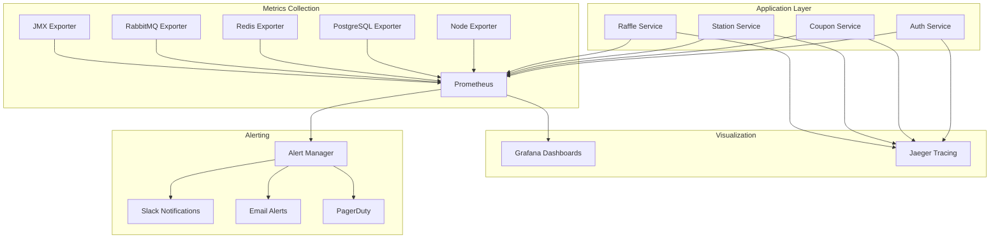

# 📊 Performance Monitoring & Profiling Guide - Gasolinera JSM

## 📋 Overview

Esta guía documenta la implementación completa de performance monitoring y profiling para Gasolinera JSM. Incluye APM (Application Performance Monitoring), profiling de memoria y CPU, dashboards de Grafana, y alerting automático para degradación de performance.

## 🎯 Monitoring Architecture

### Stack de Observabilidad



## 🔧 APM Configuration

### 1. Application Performance Monitoring Setup

#### Micrometer Integration

```kotlin
// build.gradle.kts
dependencies {
    implementation("org.springframework.boot:spring-boot-starter-actuator")
    implementation("io.micrometer:micrometer-registry-prometheus")
    implementation("io.micrometer:micrometer-tracing-bridge-brave")
    implementation("io.zipkin.reporter2:zipkin-reporter-brave")
}
```

#### Custom Metrics Configuration

```kotlin
@Configuration
class MetricsConfiguration {

    @Bean
    fun meterRegistryCustomizer(): MeterRegistryCustomizer<MeterRegistry> {
        return MeterRegistryCustomizer { registry ->
            registry.config()
                .commonTags("application", "gasolinera-jsm")
                .commonTags("environment", getEnvironment())
        }
    }

    @Bean
    fun timedAspect(registry: MeterRegistry): TimedAspect {
        return TimedAspect(registry)
    }

    @Bean
    fun countedAspect(registry: MeterRegistry): CountedAspect {
        return CountedAspect(registry)
    }
}
```

#### Performance Metrics Implementation

```kotlin
@Component
class PerformanceMetrics(private val meterRegistry: MeterRegistry) {

    // Business metrics
    private val couponCreationTimer = Timer.builder("coupon.creation.duration")
        .description("Time taken to create a coupon")
        .register(meterRegistry)

    private val databaseQueryTimer = Timer.builder("database.query.duration")
        .description("Database query execution time")
        .register(meterRegistry)

    // Usage examples
    fun <T> timeCouponCreation(operation: () -> T): T {
        return couponCreationTimer.recordCallable(operation)!!
    }

    fun recordDatabaseQuery(queryType: String, duration: Duration) {
        Timer.builder("database.query.duration")
            .tag("query_type", queryType)
            .register(meterRegistry)
            .record(duration)
    }
}
```

### 2. JVM Profiling Configuration

#### Memory Profiling

```kotlin
@Component
class MemoryProfiler(private val meterRegistry: MeterRegistry) {

    private val memoryMXBean = ManagementFactory.getMemoryMXBean()

    @Scheduled(fixedRate = 30000) // Every 30 seconds
    fun recordMemoryMetrics() {
        val heapMemory = memoryMXBean.heapMemoryUsage
        val nonHeapMemory = memoryMXBean.nonHeapMemoryUsage

        meterRegistry.gauge("jvm.memory.heap.used", heapMemory.used.toDouble())
        meterRegistry.gauge("jvm.memory.heap.max", heapMemory.max.toDouble())
        meterRegistry.gauge("jvm.memory.heap.utilization",
            heapMemory.used.toDouble() / heapMemory.max.toDouble())

        // Check for memory pressure
        val heapUtilization = heapMemory.used.toDouble() / heapMemory.max.toDouble()
        if (heapUtilization > 0.9) {
            recordMemoryPressureEvent(heapUtilization)
        }
    }

    private fun recordMemoryPressureEvent(utilization: Double) {
        meterRegistry.counter("memory.pressure.events",
            "severity", if (utilization > 0.95) "critical" else "warning"
        ).increment()
    }
}
```

#### CPU Profiling

```kotlin
@Component
class CPUProfiler(private val meterRegistry: MeterRegistry) {

    private val threadMXBean = ManagementFactory.getThreadMXBean()
    private var lastCpuTime = 0L
    private var lastUpTime = 0L

    @Scheduled(fixedRate = 15000) // Every 15 seconds
    fun recordCPUMetrics() {
        val currentCpuTime = threadMXBean.getCurrentThreadCpuTime()
        val currentUpTime = ManagementFactory.getRuntimeMXBean().uptime

        if (lastCpuTime > 0 && lastUpTime > 0) {
            val cpuUsage = (currentCpuTime - lastCpuTime).toDouble() /
                          ((currentUpTime - lastUpTime) * 1_000_000.0)

            meterRegistry.gauge("process.cpu.usage", cpuUsage)

            // Alert on high CPU usage
            if (cpuUsage > 0.8) {
                recordHighCPUEvent(cpuUsage)
            }
        }

        lastCpuTime = currentCpuTime
        lastUpTime = currentUpTime
    }

    private fun recordHighCPUEvent(usage: Double) {
        meterRegistry.counter("cpu.high.usage.events",
            "severity", if (usage > 0.9) "critical" else "warning"
        ).increment()
    }
}
```

### 3. Database Performance Monitoring

#### HikariCP Metrics

```kotlin
@Configuration
class DatabaseMetricsConfiguration {

    @Bean
    @Primary
    fun dataSource(): HikariDataSource {
        val config = HikariConfig().apply {
            jdbcUrl = "jdbc:postgresql://localhost:5432/gasolinera_jsm"
            username = "gasolinera_user"
            password = "secure_password"

            // Performance settings
            maximumPoolSize = 20
            minimumIdle = 5
            connectionTimeout = 30000
            idleTimeout = 600000
            maxLifetime = 1800000

            // Enable metrics
            isRegisterMbeans = true
            metricRegistry = PrometheusMeterRegistry(PrometheusConfig.DEFAULT)
        }

        return HikariDataSource(config)
    }
}
```

#### Query Performance Tracking

```kotlin
@Component
class QueryPerformanceTracker(private val performanceMetrics: PerformanceMetrics) {

    @EventListener
    fun handleSlowQuery(event: SlowQueryEvent) {
        performanceMetrics.recordDatabaseQuery(
            queryType = event.queryType,
            duration = event.duration
        )

        if (event.duration > Duration.ofSeconds(1)) {
            logger.warn("Slow query detected: ${event.sql} took ${event.duration}")
        }
    }
}
```

## 📊 Grafana Dashboards

### 1. Performance Overview Dashboard

#### Key Metrics Panels

- **Service Status**: Up/Down status of all services
- **Request Rate**: Requests per second by service
- **Response Time**: 95th percentile response times
- **Error Rate**: Error percentage by service
- **JVM Memory**: Heap usage and GC metrics
- **CPU Usage**: Process CPU utilization
- **Database Connections**: Connection pool usage
- **Thread Count**: Active thread monitoring

#### Dashboard Configuration

```json
{
  "dashboard": {
    "title": "Gasolinera JSM - Performance Overview",
    "panels": [
      {
        "title": "Request Rate (RPS)",
        "type": "timeseries",
        "targets": [
          {
            "expr": "sum(rate(http_server_requests_total[5m])) by (job)",
            "legendFormat": "{{job}}"
          }
        ]
      },
      {
        "title": "Response Time (95th Percentile)",
        "type": "timeseries",
        "targets": [
          {
            "expr": "histogram_quantile(0.95, sum(rate(http_server_requests_seconds_bucket[5m])) by (job, le))",
            "legendFormat": "{{job}} - 95th percentile"
          }
        ]
      }
    ]
  }
}
```

### 2. Business Metrics Dashboard

#### Business KPIs

- **Coupon Creation Rate**: Coupons created per minute
- **Redemption Success Rate**: Successful redemptions percentage
- **Revenue Trends**: Revenue per hour by fuel type
- **User Activity**: Registrations and logins
- **Raffle Participation**: Ticket generation rates

### 3. Infrastructure Dashboard

#### System Metrics

- **System Load**: CPU, Memory, Disk usage
- **Network I/O**: Network traffic patterns
- **Database Performance**: Query rates, connection usage
- **Cache Performance**: Redis hit/miss ratios
- **Message Queue**: RabbitMQ queue depths and processing rates

## 🚨 Alerting Configuration

### 1. Performance Alerts

#### Response Time Alerts

```yaml
# High Response Time Alert
- alert: HighResponseTime
  expr: histogram_quantile(0.95, rate(http_server_requests_seconds_bucket[5m])) > 0.5
  for: 2m
  labels:
    severity: warning
    team: backend
  annotations:
    summary: 'High response time detected'
    description: '95th percentile response time is {{ $value }}s'
    runbook_url: 'https://docs.gasolinera-jsm.com/runbooks/high-response-time'

# Critical Response Time Alert
- alert: CriticalResponseTime
  expr: histogram_quantile(0.95, rate(http_server_requests_seconds_bucket[5m])) > 1.0
  for: 1m
  labels:
    severity: critical
    team: backend
  annotations:
    summary: 'Critical response time detected'
    description: '95th percentile response time is {{ $value }}s'
```

#### Memory Alerts

```yaml
# High Memory Usage Alert
- alert: HighMemoryUsage
  expr: (jvm_memory_used_bytes{area="heap"} / jvm_memory_max_bytes{area="heap"}) > 0.8
  for: 5m
  labels:
    severity: warning
  annotations:
    summary: 'High memory usage detected'
    description: 'Memory usage is {{ $value | humanizePercentage }}'

# Critical Memory Usage Alert
- alert: CriticalMemoryUsage
  expr: (jvm_memory_used_bytes{area="heap"} / jvm_memory_max_bytes{area="heap"}) > 0.9
  for: 2m
  labels:
    severity: critical
  annotations:
    summary: 'Critical memory usage detected'
    description: 'Memory usage is {{ $value | humanizePercentage }}'
```

#### Database Alerts

```yaml
# Database Connection Pool Alert
- alert: DatabaseConnectionPoolHigh
  expr: (hikaricp_connections_active / hikaricp_connections_max) > 0.8
  for: 2m
  labels:
    severity: warning
  annotations:
    summary: 'Database connection pool usage high'
    description: 'Connection pool usage is {{ $value | humanizePercentage }}'

# Database Connection Pool Exhausted
- alert: DatabaseConnectionPoolExhausted
  expr: (hikaricp_connections_active / hikaricp_connections_max) > 0.95
  for: 1m
  labels:
    severity: critical
  annotations:
    summary: 'Database connection pool nearly exhausted'
    description: 'Connection pool usage is {{ $value | humanizePercentage }}'
```

### 2. Business Metrics Alerts

#### Business Performance Alerts

```yaml
# Low Coupon Creation Rate
- alert: LowCouponCreationRate
  expr: rate(coupon_created_total[10m]) < 0.1
  for: 5m
  labels:
    severity: warning
    team: business
  annotations:
    summary: 'Low coupon creation rate detected'
    description: 'Coupon creation rate is {{ $value }} per second'

# High Redemption Failure Rate
- alert: HighRedemptionFailureRate
  expr: rate(coupon_redemption_failed_total[5m]) / rate(coupon_redemption_total[5m]) > 0.05
  for: 3m
  labels:
    severity: warning
    team: business
  annotations:
    summary: 'High coupon redemption failure rate'
    description: 'Redemption failure rate is {{ $value | humanizePercentage }}'
```

### 3. SLA Monitoring

#### SLA Violation Alerts

```yaml
# Availability SLA Violation
- alert: SLAViolationAvailability
  expr: (rate(http_server_requests_total{status!~"5.."}[5m]) / rate(http_server_requests_total[5m])) < 0.999
  for: 5m
  labels:
    severity: critical
    team: sre
    sla: availability
  annotations:
    summary: 'SLA violation: Availability below 99.9%'
    description: 'Service availability is {{ $value | humanizePercentage }}'

# Latency SLA Violation
- alert: SLAViolationLatency
  expr: histogram_quantile(0.95, rate(http_server_requests_seconds_bucket[5m])) > 0.2
  for: 5m
  labels:
    severity: critical
    team: sre
    sla: latency
  annotations:
    summary: 'SLA violation: 95th percentile latency above 200ms'
    description: '95th percentile latency is {{ $value }}s'
```

## 🔧 Performance Profiling

### 1. Method-Level Profiling

#### Profiling Annotations

```kotlin
@Component
class CouponService(private val profiler: PerformanceProfiler) {

    @Timed(name = "coupon.creation", description = "Time taken to create coupon")
    fun createCoupon(request: CreateCouponRequest): Coupon {
        return profiler.profileMethod("CouponService", "createCoupon") {
            // Business logic here
            processCouponCreation(request)
        }
    }

    @Counted(name = "coupon.validation", description = "Coupon validation attempts")
    fun validateCoupon(coupon: Coupon): ValidationResult {
        return profiler.profile("coupon-validation") {
            // Validation logic here
            performValidation(coupon)
        }
    }
}
```

### 2. Memory Leak Detection

#### Memory Analysis

```kotlin
@Component
class MemoryLeakDetector(private val profiler: PerformanceProfiler) {

    @Scheduled(fixedRate = 300000) // Every 5 minutes
    fun analyzeMemoryUsage() {
        val analysis = profiler.analyzeMemoryAllocation()

        if (analysis.heapUtilization > 0.85) {
            logger.warn("High memory usage detected: ${analysis.heapUtilization}")

            // Generate memory report
            val report = generateMemoryReport(analysis)
            sendMemoryAlert(report)
        }
    }

    private fun generateMemoryReport(analysis: MemoryAnalysis): MemoryReport {
        return MemoryReport(
            timestamp = Instant.now(),
            heapUsage = analysis.heapUtilization,
            gcCollections = analysis.gcCollections,
            gcTime = analysis.gcTime,
            recommendations = generateMemoryRecommendations(analysis)
        )
    }
}
```

### 3. Performance Regression Detection

#### Baseline Comparison

```kotlin
@Component
class PerformanceRegressionDetector(
    private val meterRegistry: MeterRegistry
) {

    private val baselineMetrics = ConcurrentHashMap<String, Double>()

    @Scheduled(fixedRate = 600000) // Every 10 minutes
    fun checkForRegressions() {
        val currentMetrics = getCurrentPerformanceMetrics()

        currentMetrics.forEach { (metric, value) ->
            val baseline = baselineMetrics[metric]
            if (baseline != null) {
                val regression = (value - baseline) / baseline

                if (regression > 0.2) { // 20% regression threshold
                    recordPerformanceRegression(metric, baseline, value, regression)
                }
            }

            // Update baseline (rolling average)
            baselineMetrics[metric] = baseline?.let { (it * 0.9) + (value * 0.1) } ?: value
        }
    }

    private fun recordPerformanceRegression(
        metric: String,
        baseline: Double,
        current: Double,
        regression: Double
    ) {
        meterRegistry.counter("performance.regression.detected",
            "metric", metric,
            "severity", if (regression > 0.5) "critical" else "warning"
        ).increment()

        logger.warn("Performance regression detected for $metric: " +
                   "baseline=$baseline, current=$current, regression=${regression * 100}%")
    }
}
```

## 📈 Performance Optimization

### 1. Automatic Performance Tuning

#### JVM Tuning Recommendations

```kotlin
@Component
class JVMTuningAdvisor(private val profiler: PerformanceProfiler) {

    fun generateTuningRecommendations(): List<TuningRecommendation> {
        val memoryAnalysis = profiler.analyzeMemoryAllocation()
        val threadAnalysis = profiler.analyzeThreadUsage()
        val recommendations = mutableListOf<TuningRecommendation>()

        // Memory recommendations
        if (memoryAnalysis.heapUtilization > 0.8) {
            recommendations.add(TuningRecommendation(
                type = "MEMORY",
                priority = "HIGH",
                description = "Increase heap size or optimize memory usage",
                action = "Consider increasing -Xmx parameter or review object allocation patterns"
            ))
        }

        // GC recommendations
        if (memoryAnalysis.gcTime > 1000) {
            recommendations.add(TuningRecommendation(
                type = "GC",
                priority = "MEDIUM",
                description = "High GC time detected",
                action = "Consider tuning GC parameters or using G1GC"
            ))
        }

        // Thread recommendations
        if (threadAnalysis.currentThreadCount > 200) {
            recommendations.add(TuningRecommendation(
                type = "THREADS",
                priority = "MEDIUM",
                description = "High thread count detected",
                action = "Review thread pool configurations and async processing"
            ))
        }

        return recommendations
    }
}
```

### 2. Cache Performance Optimization

#### Cache Hit Rate Monitoring

```kotlin
@Component
class CachePerformanceMonitor(private val performanceMetrics: PerformanceMetrics) {

    @EventListener
    fun handleCacheAccess(event: CacheAccessEvent) {
        if (event.hit) {
            performanceMetrics.recordCacheHit(event.cacheName, event.key)
        } else {
            performanceMetrics.recordCacheMiss(event.cacheName, event.key)
        }

        // Check cache performance
        val hitRatio = performanceMetrics.getCacheHitRatio(event.cacheName)
        if (hitRatio < 0.8) {
            logger.warn("Low cache hit ratio for ${event.cacheName}: $hitRatio")
            suggestCacheOptimizations(event.cacheName, hitRatio)
        }
    }

    private fun suggestCacheOptimizations(cacheName: String, hitRatio: Double) {
        // Generate cache optimization suggestions
        val suggestions = when {
            hitRatio < 0.5 -> listOf(
                "Review cache key patterns",
                "Increase cache size",
                "Adjust TTL settings"
            )
            hitRatio < 0.8 -> listOf(
                "Optimize cache warming strategy",
                "Review cache eviction policy"
            )
            else -> emptyList()
        }

        logger.info("Cache optimization suggestions for $cacheName: $suggestions")
    }
}
```

## 🚀 Deployment and Operations

### 1. Monitoring Stack Deployment

#### Docker Compose Setup

```bash
# Start monitoring stack
docker-compose -f docker-compose.monitoring.yml up -d

# Verify services
docker-compose -f docker-compose.monitoring.yml ps

# Check Prometheus targets
curl http://localhost:9090/api/v1/targets

# Access Grafana
open http://localhost:3000
```

#### Kubernetes Deployment

```yaml
# monitoring-namespace.yaml
apiVersion: v1
kind: Namespace
metadata:
  name: monitoring

---
# prometheus-deployment.yaml
apiVersion: apps/v1
kind: Deployment
metadata:
  name: prometheus
  namespace: monitoring
spec:
  replicas: 1
  selector:
    matchLabels:
      app: prometheus
  template:
    metadata:
      labels:
        app: prometheus
    spec:
      containers:
        - name: prometheus
          image: prom/prometheus:v2.45.0
          ports:
            - containerPort: 9090
          volumeMounts:
            - name: config
              mountPath: /etc/prometheus
            - name: storage
              mountPath: /prometheus
      volumes:
        - name: config
          configMap:
            name: prometheus-config
        - name: storage
          persistentVolumeClaim:
            claimName: prometheus-storage
```

### 2. Performance Testing Integration

#### K6 Performance Tests

```javascript
// performance-tests/load-test.js
import http from 'k6/http';
import { check, sleep } from 'k6';
import { Rate, Trend } from 'k6/metrics';

const errorRate = new Rate('errors');
const responseTime = new Trend('response_time');

export let options = {
  stages: [
    { duration: '2m', target: 100 }, // Ramp up
    { duration: '5m', target: 100 }, // Stay at 100 users
    { duration: '2m', target: 200 }, // Ramp up to 200 users
    { duration: '5m', target: 200 }, // Stay at 200 users
    { duration: '2m', target: 0 }, // Ramp down
  ],
  thresholds: {
    http_req_duration: ['p(95)<500'], // 95% of requests under 500ms
    http_req_failed: ['rate<0.01'], // Error rate under 1%
  },
};

export default function () {
  // Test coupon creation
  let createResponse = http.post('http://api-gateway:8080/api/v1/coupons', {
    stationId: 'station-123',
    amount: 100.0,
    fuelType: 'REGULAR',
  });

  check(createResponse, {
    'coupon creation status is 200': r => r.status === 200,
    'coupon creation response time < 500ms': r => r.timings.duration < 500,
  });

  errorRate.add(createResponse.status !== 200);
  responseTime.add(createResponse.timings.duration);

  sleep(1);
}
```

### 3. Automated Performance Reports

#### Daily Performance Report

```bash
#!/bin/bash
# scripts/generate-performance-report.sh

DATE=$(date +%Y-%m-%d)
REPORT_FILE="reports/performance-report-$DATE.html"

# Query Prometheus for key metrics
PROMETHEUS_URL="http://localhost:9090"

# Get average response time
AVG_RESPONSE_TIME=$(curl -s "$PROMETHEUS_URL/api/v1/query?query=avg(rate(http_server_requests_seconds_sum[24h])/rate(http_server_requests_seconds_count[24h]))" | jq -r '.data.result[0].value[1]')

# Get error rate
ERROR_RATE=$(curl -s "$PROMETHEUS_URL/api/v1/query?query=rate(http_server_requests_total{status=~\"5..\"}[24h])/rate(http_server_requests_total[24h])" | jq -r '.data.result[0].value[1]')

# Generate HTML report
cat > "$REPORT_FILE" << EOF
<!DOCTYPE html>
<html>
<head>
    <title>Performance Report - $DATE</title>
</head>
<body>
    <h1>Daily Performance Report - $DATE</h1>
    <h2>Key Metrics</h2>
    <ul>
        <li>Average Response Time: ${AVG_RESPONSE_TIME}s</li>
        <li>Error Rate: ${ERROR_RATE}%</li>
    </ul>
</body>
</html>
EOF

echo "Performance report generated: $REPORT_FILE"
```

---

**📊 Esta configuración de performance monitoring proporciona observabilidad completa y proactiva para mantener Gasolinera JSM funcionando con performance óptimo.**

_Última actualización: Enero 2024_
