# 🚀 Developer Onboarding Guide - Gasolinera JSM

## 👋 Welcome to Gasolinera JSM!

Esta guía te ayudará a configurar tu entorno de desarrollo y entender la arquitectura del sistema en menos de un día. Gasolinera JSM es una plataforma de cupones de combustible y rifas construida con arquitectura hexagonal y patrones de clase mundial.

## 📋 Prerequisites

### Required Software

- **Java 17+** (OpenJDK recomendado)
- **Docker & Docker Compose** (para desarrollo local)
- **Git** (para control de versiones)
- **IntelliJ IDEA** o **VS Code** (IDEs recomendados)

### Optional but Recommended

- **Postman** o **Insomnia** (para testing de APIs)
- **DBeaver** o **pgAdmin** (para gestión de BD)
- **Redis CLI** (para debugging de cache)

## 🛠️ Environment Setup

### 1. Clone the Repository

```bash
git clone https://github.com/your-org/gasolinera-jsm-ultimate.git
cd gasolinera-jsm-ultimate
```

### 2. Environment Configuration

```bash
# Copy environment template
cp .env.example .env.development

# Edit with your local settings
nano .env.development
```

**Key Environment Variables:**

```bash
# Database
DB_HOST=localhost
DB_PORT=5432
DB_NAME=gasolinera_jsm_dev
DB_USERNAME=gasolinera_user
DB_PASSWORD=dev_password

# Redis
REDIS_HOST=localhost
REDIS_PORT=6379
REDIS_PASSWORD=dev_redis_password

# JWT
JWT_PRIVATE_KEY_PATH=./config/keys/jwt-private.pem
JWT_PUBLIC_KEY_PATH=./config/keys/jwt-public.pem

# External Services
STRIPE_API_KEY=sk_test_your_stripe_key
SMTP_HOST=localhost
SMTP_PORT=1025
```

### 3. Start Development Infrastructure

```bash
# Start all infrastructure services
docker-compose -f docker-compose.dev.yml up -d

# Verify services are running
docker-compose -f docker-compose.dev.yml ps
```

This will start:

- **PostgreSQL** (port 5432)
- **Redis** (port 6379)
- **RabbitMQ** (port 5672, management UI: 15672)
- **MailHog** (SMTP testing, UI: 8025)
- **Jaeger** (tracing UI: 16686)
- **Prometheus** (metrics: 9090)
- **Grafana** (dashboards: 3000)

### 4. Database Setup

```bash
# Run database migrations
./gradlew flywayMigrate

# Seed development data
./gradlew seedDevData

# Verify database setup
docker exec -it gasolinera_postgres psql -U gasolinera_user -d gasolinera_jsm_dev -c "\dt"
```

### 5. Build and Test

```bash
# Build all services
./gradlew build

# Run tests
./gradlew test

# Run integration tests
./gradlew integrationTest

# Check code quality
./gradlew detekt ktlintCheck
```

## 🏗️ Architecture Overview

### System Architecture

```mermaid
graph TB
    subgraph "Client Layer"
        Mobile[📱 Mobile App]
        Web[🌐 Web App]
        Admin[👨‍💼 Admin Panel]
    end

    subgraph "API Layer"
        Gateway[🚪 API Gateway :8080]
    end

    subgraph "Microservices"
        Auth[🔐 Auth Service :8081]
        Station[⛽ Station Service :8083]
        Coupon[🎫 Coupon Service :8084]
        Raffle[🎰 Raffle Service :8085]
        Dashboard[📊 Dashboard Service :8086]
    end

    subgraph "Data Layer"
        Postgres[(🗄️ PostgreSQL)]
        Redis[(🔴 Redis)]
        RabbitMQ[🐰 RabbitMQ]
    end

    Mobile --> Gateway
    Web --> Gateway
    Admin --> Gateway

    Gateway --> Auth
    Gateway --> Station
    Gateway --> Coupon
    Gateway --> Raffle
    Gateway --> Dashboard

    Auth --> Postgres
    Station --> Postgres
    Coupon --> Postgres
    Raffle --> Postgres

    Auth --> Redis
    Station --> Redis
    Coupon --> Redis

    Coupon --> RabbitMQ
    Raffle --> RabbitMQ
```



### Service Responsibilities

| Service               | Port | Responsibility                  | Key Entities                 |
| --------------------- | ---- | ------------------------------- | ---------------------------- |
| **API Gateway**       | 8080 | Routing, Auth, Rate Limiting    | -                            |
| **Auth Service**      | 8081 | Authentication, Authorization   | User, Role, Permission       |
| **Station Service**   | 8083 | Gas Stations, Prices, Locations | Station, FuelPrice, Location |
| **Coupon Service**    | 8084 | Coupon Lifecycle, Payments      | Coupon, Payment, QRCode      |
| **Raffle Service**    | 8085 | Raffles, Tickets, Winners       | Raffle, Ticket, Prize        |
| **Dashboard Service** | 8086 | Analytics, Reporting            | Report, Metric, Dashboard    |

## 🏛️ Hexagonal Architecture

Each service follows **Hexagonal Architecture** (Ports & Adapters):

```
📁 src/main/kotlin/com/gasolinerajsm/{service}/
├── 🏛️ domain/                    # Core business logic
│   ├── entities/                 # Domain entities
│   ├── valueobjects/            # Value objects
│   ├── services/                # Domain services
│   ├── events/                  # Domain events
│   └── ports/                   # Repository interfaces
├── 🎯 application/               # Use cases & orchestration
│   ├── usecases/                # Business use cases
│   ├── commands/                # Command objects
│   ├── queries/                 # Query objects
│   └── ports/                   # Use case interfaces
└── 🔌 infrastructure/            # External concerns
    ├── controllers/             # REST controllers
    ├── repositories/            # JPA repositories
    ├── clients/                 # External service clients
    ├── messaging/               # Message publishers/consumers
    └── config/                  # Configuration classes
```

### Example: Coupon Service Structure

```kotlin
// 🏛️ Domain Entity
data class Coupon(
    val id: CouponId,
    val userId: UserId,
    val amount: Money,
    val status: CouponStatus,
    // ... other properties
) {
    fun redeem(location: Location): RedemptionResult {
        // Business logic here
    }
}

// 🎯 Use Case
@Service
class CreateCouponUseCase(
    private val couponRepository: CouponRepository,
    private val paymentService: PaymentService
) {
    suspend fun execute(command: CreateCouponCommand): Result<CouponResponse> {
        // Orchestration logic here
    }
}

// 🔌 REST Controller
@RestController
class CouponController(
    private val createCouponUseCase: CreateCouponUseCase
) {
    @PostMapping("/api/v1/coupons")
    suspend fun createCoupon(@RequestBody request: CreateCouponRequest) {
        // HTTP handling here
    }
}
```

## 🚀 Development Workflow

### 1. Feature Development Process

```mermaid
graph LR
    A[📋 Pick Task] --> B[🌿 Create Branch]
    B --> C[💻 Implement]
    C --> D[🧪 Write Tests]
    D --> E[✅ Run Tests]
    E --> F[📝 Code Review]
    F --> G[🚀 Deploy to Dev]
    G --> H[🔄 Merge to Main]
```



### 2. Branch Naming Convention

```bash
# Feature branches
feature/TASK-123-implement-coupon-redemption

# Bug fixes
bugfix/TASK-456-fix-payment-validation

# Hotfixes
hotfix/TASK-789-critical-security-patch
```

### 3. Commit Message Format

```bash
# Format: type(scope): description
feat(coupon): implement QR code generation
fix(auth): resolve JWT token expiration issue
docs(api): update OpenAPI specifications
test(raffle): add integration tests for winner selection
```

### 4. Testing Guidelines

```bash
# Run specific service tests
./gradlew :coupon-service:test

# Run integration tests
./gradlew :coupon-service:integrationTest

# Run all tests with coverage
./gradlew test jacocoTestReport

# Check coverage threshold (minimum 85%)
./gradlew jacocoTestCoverageVerification
```

## 🧪 Testing Strategy

### Test Pyramid

```mermaid
graph TB
    subgraph "Test Pyramid"
        E2E[🎭 E2E Tests<br/>10% - Full user journeys]
        Integration[🔗 Integration Tests<br/>20% - Service boundaries]
        Unit[⚡ Unit Tests<br/>70% - Business logic]
    end
```



### Unit Tests (70%)

```kotlin
@ExtendWith(MockitoExtension::class)
class CreateCouponUseCaseTest {

    @Mock
    private lateinit var couponRepository: CouponRepository

    @InjectMocks
    private lateinit var useCase: CreateCouponUseCase

    @Test
    fun `should create coupon with valid parameters`() {
        // Given
        val command = CreateCouponCommand(...)

        // When
        val result = useCase.execute(command)

        // Then
        assertThat(result.isSuccess).isTrue()
    }
}
```

### Integration Tests (20%)

```kotlin
@SpringBootTest
@Testcontainers
class CouponRepositoryIntegrationTest {

    @Container
    static val postgres = PostgreSQLContainer("postgres:15")

    @Test
    fun `should save and retrieve coupon`() {
        // Test with real database
    }
}
```

### E2E Tests (10%)

```kotlin
@SpringBootTest(webEnvironment = RANDOM_PORT)
class CouponE2ETest {

    @Test
    fun `should complete full coupon lifecycle`() {
        // Test complete user journey
    }
}
```

## 🔧 Development Tools

### IDE Configuration

#### IntelliJ IDEA

1. Install plugins:
   - **Kotlin**
   - **Spring Boot**
   - **Docker**
   - **Database Navigator**

2. Import code style:

   ```bash
   # Import from project root
   .idea/codeStyles/Project.xml
   ```

3. Configure run configurations:
   - **Auth Service**: Main class `AuthServiceApplication`
   - **Coupon Service**: Main class `CouponServiceApplication`
   - etc.

#### VS Code

1. Install extensions:
   - **Extension Pack for Java**
   - **Spring Boot Extension Pack**
   - **Kotlin Language**
   - **Docker**

2. Configure settings:
   ```json
   {
     "java.configuration.updateBuildConfiguration": "automatic",
     "spring-boot.ls.problem.application-properties.unknown-property": "ignore"
   }
   ```

### Debugging

#### Local Debugging

```bash
# Start service in debug mode
./gradlew :coupon-service:bootRun --debug-jvm

# Or with specific debug port
JAVA_OPTS="-agentlib:jdwp=transport=dt_socket,server=y,suspend=n,address=5005" \
./gradlew :coupon-service:bootRun
```

#### Remote Debugging

```bash
# Connect to service running in Docker
docker-compose -f docker-compose.dev.yml up -d coupon-service-debug
```

### Database Management

#### Migrations with Flyway

```bash
# Create new migration
touch src/main/resources/db/migration/V1.2__Add_coupon_expiration.sql

# Run migrations
./gradlew flywayMigrate

# Check migration status
./gradlew flywayInfo
```

#### Sample Migration

```sql
-- V1.2__Add_coupon_expiration.sql
ALTER TABLE coupons
ADD COLUMN expires_at TIMESTAMP NOT NULL DEFAULT (CURRENT_TIMESTAMP + INTERVAL '30 days');

CREATE INDEX idx_coupons_expires_at ON coupons(expires_at);
```

## 📊 Monitoring & Observability

### Local Development Dashboards

| Service        | URL                    | Credentials |
| -------------- | ---------------------- | ----------- |
| **Grafana**    | http://localhost:3000  | admin/admin |
| **Prometheus** | http://localhost:9090  | -           |
| **Jaeger**     | http://localhost:16686 | -           |
| **RabbitMQ**   | http://localhost:15672 | guest/guest |
| **MailHog**    | http://localhost:8025  | -           |

### Key Metrics to Monitor

```kotlin
// Custom business metrics
@Component
class CouponMetrics(private val meterRegistry: MeterRegistry) {

    private val couponCreationCounter = Counter.builder("coupon.created.total")
        .description("Total coupons created")
        .register(meterRegistry)

    fun recordCouponCreation(fuelType: FuelType) {
        couponCreationCounter.increment(Tag.of("fuel_type", fuelType.name))
    }
}
```

### Distributed Tracing

```kotlin
// Add custom spans
@NewSpan("coupon-validation")
suspend fun validateCoupon(@SpanTag("couponId") couponId: String) {
    // Business logic with automatic tracing
}
```

## 🐛 Troubleshooting

### Common Issues

#### 1. Database Connection Issues

```bash
# Check if PostgreSQL is running
docker-compose -f docker-compose.dev.yml ps postgres

# Check logs
docker-compose -f docker-compose.dev.yml logs postgres

# Reset database
docker-compose -f docker-compose.dev.yml down -v
docker-compose -f docker-compose.dev.yml up -d postgres
./gradlew flywayMigrate
```

#### 2. Redis Connection Issues

```bash
# Test Redis connection
docker exec -it gasolinera_redis redis-cli ping

# Check Redis logs
docker-compose -f docker-compose.dev.yml logs redis

# Clear Redis cache
docker exec -it gasolinera_redis redis-cli FLUSHALL
```

#### 3. Service Startup Issues

```bash
# Check service logs
./gradlew :coupon-service:bootRun --info

# Check for port conflicts
lsof -i :8084

# Clean and rebuild
./gradlew clean build
```

#### 4. Test Failures

```bash
# Run tests with detailed output
./gradlew test --info

# Run specific test class
./gradlew :coupon-service:test --tests "CreateCouponUseCaseTest"

# Debug test with JVM debug
./gradlew test --debug-jvm
```

### Performance Issues

#### 1. Slow Database Queries

```sql
-- Enable query logging in PostgreSQL
ALTER SYSTEM SET log_statement = 'all';
ALTER SYSTEM SET log_min_duration_statement = 100;
SELECT pg_reload_conf();

-- Check slow queries
SELECT query, mean_time, calls
FROM pg_stat_statements
ORDER BY mean_time DESC
LIMIT 10;
```

#### 2. Memory Issues

```bash
# Check JVM memory usage
jstat -gc <pid>

# Heap dump analysis
jcmd <pid> GC.run_finalization
jcmd <pid> VM.classloader_stats
```

## 📚 Learning Resources

### Architecture & Patterns

- [Hexagonal Architecture Guide](./hexagonal-patterns.md)
- [Design Decisions (ADRs)](./design-decisions.md)
- [Domain-Driven Design](https://www.domainlanguage.com/ddd/)

### Technology Stack

- [Spring Boot Documentation](https://spring.io/projects/spring-boot)
- [Kotlin Coroutines](https://kotlinlang.org/docs/coroutines-overview.html)
- [PostgreSQL Documentation](https://www.postgresql.org/docs/)
- [Redis Documentation](https://redis.io/documentation)

### Testing

- [TestContainers](https://www.testcontainers.org/)
- [MockK for Kotlin](https://mockk.io/)
- [Spring Boot Testing](https://spring.io/guides/gs/testing-web/)

## 🤝 Team Collaboration

### Code Review Guidelines

#### Before Submitting PR

- ✅ All tests pass locally
- ✅ Code coverage >= 85%
- ✅ No linting errors
- ✅ Documentation updated
- ✅ Self-review completed

#### PR Template

```markdown
## Description

Brief description of changes

## Type of Change

- [ ] Bug fix
- [ ] New feature
- [ ] Breaking change
- [ ] Documentation update

## Testing

- [ ] Unit tests added/updated
- [ ] Integration tests added/updated
- [ ] Manual testing completed

## Checklist

- [ ] Code follows style guidelines
- [ ] Self-review completed
- [ ] Documentation updated
- [ ] No breaking changes
```

### Communication Channels

- **#gasolinera-dev**: General development discussions
- **#gasolinera-alerts**: Production alerts and incidents
- **#gasolinera-releases**: Release announcements
- **#architecture**: Architecture discussions and decisions

## 🎯 Next Steps

### Your First Week

1. **Day 1-2**: Environment setup and architecture understanding
2. **Day 3-4**: Pick a small bug fix or documentation task
3. **Day 5**: Implement your first feature with tests
4. **Week 2**: Take on a medium-complexity feature

### Suggested First Tasks

- Fix a small bug in validation logic
- Add a new endpoint to an existing service
- Improve test coverage for a specific component
- Update documentation or add examples

### Getting Help

- **Slack**: Ask questions in #gasolinera-dev
- **Code Reviews**: Learn from feedback on your PRs
- **Pair Programming**: Schedule sessions with senior developers
- **Architecture Sessions**: Attend weekly architecture discussions

---

**🎉 Welcome to the team! You're now ready to contribute to Gasolinera JSM's world-class platform.**

_Happy coding! 🚀_
